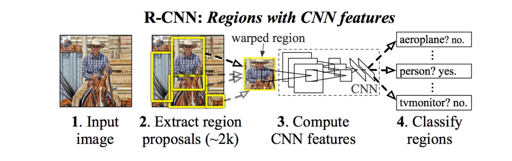
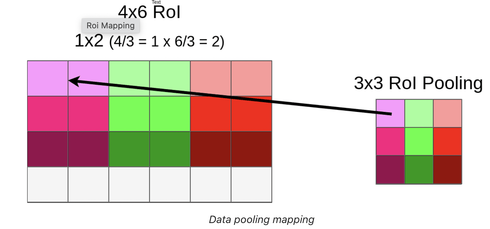
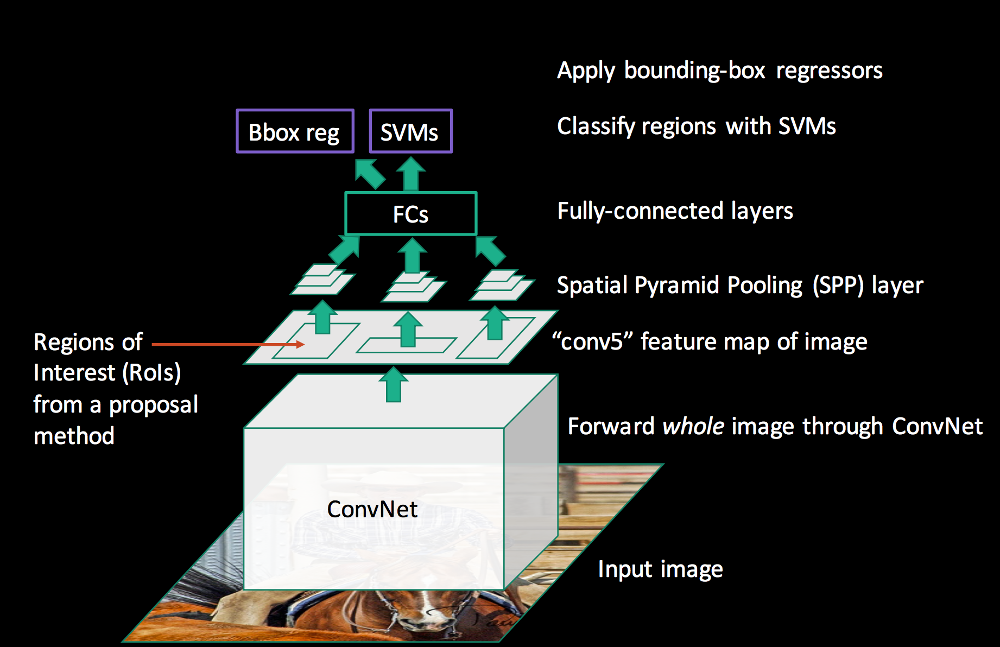

# Region based CNN (R-CNN)

## Introduction

1. Object detection is the task of finding the different objects in an image and classifying them.
1. **Region-CNN:**  The goal of R-CNN is to take in an image, and correctly identify where the main objects (via a bounding box) in the image.
    **Inputs:** Image 
    **Outputs:** Bounding boxes [4 corners co-ordinates] + labels for each object in the image.

1. Detection pipeline : Region Proposal generator $\rightarrow$ Feature extractor $\rightarrow$ Classification. 

## Algorithm

 R-CNN is just the following steps:

1. The first module generates 2,000 region proposals using the Selective Search algorithm.
    * Selective Search Method: This Algorithm looks at the image through windows of different sizes, and for each size tries to group together adjacent pixels by texture, color, or intensity to identify objects.
1. After being resized to a fixed pre-defined size, the second module extracts a feature vector of length 4,096 from each region proposal.
1. The third module uses a pre-trained SVM algorithm to classify the region proposal to either the background or one of the object classes.

After creating a set of region proposals, R-CNN passes the image through a modified version of AlexNet to determine whether or not it is a valid region

## Drawbacks

1. It is a multi-stage model, where each stage is an independent component. Thus, it cannot be trained end-to-end.

1. It caches the extracted features from the pre-trained CNN on the disk to later train the SVMs. This requires hundreds of gigabytes of storage.

1. R-CNN depends on the Selective Search algorithm for generating region proposals, which takes a lot of time. Moreover, this algorithm cannot be customized to the detection problem.

1. Each region proposal is fed independently to the CNN for feature extraction. This makes it impossible to run R-CNN in real-time.

# Fast R-CNN

1. [Fast R-CNN Paper](https://arxiv.org/pdf/1504.08083.pdf)
1. [Blog](https://erdem.pl/2020/02/understanding-region-of-interest-ro-i-pooling)

## Insight 1: RoI (Region of Interest) Pooling

For the forward pass of the CNN, Girshick realized that for each image, a lot of proposed regions for the image invariably overlapped causing us to run the same CNN computation again and again (~2000 times!). His insight was simple — Why not run the CNN just once per image and then find a way to share that computation across the ~2000 proposals?

## Contributions

1. Proposed a new layer called ROI Pooling that extracts equal-length feature vectors from all proposals (i.e. ROIs) in the same image.

1. Fast R-CNN does not cache the extracted features and thus does not need so much disk storage compared to R-CNN, which needs hundreds of gigabytes.

1. Training is single-stage, using a multi-task loss.

1. Fast R-CNN is more accurate than R-CNN

## ROI Pooling layer 

### Introduction 

1. RoI (Region of Interest) is a proposed region from the original image. Each RoI is defined by a four-tuple (r, c, h, w) that specifies its top-left corner (r, c) and its height and width (h, w). 

1. The RoI pooling layer uses max pooling to convert the features inside any valid region of interest into a small fea- ture map with a fixed spatial extent of H × W (e.g., 7 × 7), where H and W are layer hyper-parameters that are inde- pendent of any particular RoI. 

1. It’s important to remember that RoI is NOT a bounding box. It might look like one but it’s just a proposal for further processing. Many people are assuming that because most of the papers and blog posts are creating proposals in place of actual objects.

### Step by step explaination

1. Lets consider the model takes an image input of size $512 \times 512 \times 3$ (width x height x RGB) and VGG16 is mapping it into a $16 \times 16 \times 512$ feature map.

1. If you look at the output matrix you should notice that it’s width and height is exactly 32 times smaller than the input image (512/32 = 16). That’s important because all RoIs have to be scaled down by this factor.

1. For easy understanding, lets consider only one ROI of size 145x200 and the top left corner is set to be in (192x296) in the original 512x512 image.
1. As you could probably tell, we’re not able to divide most of those numbers by 32.
    * width: 200/32 = 6.25
    * height: 145/32 = ~4.53
    * x: 296/32 = 9.25
    * y: 192/32 = 6

1. Only the last number (Y coordinate of the top left corner) makes sense. That’s because we’re working on a 16x16 grid right now and only numbers we care about are integers. 
1. Therefore, Quantization of coordinates on the feature map is done. The left top co-ordinates of the ROI on the feature map would be (9,6) and size would be (4x6x512). However, we would lose some data due to this quantisation process. 

1. Now RoI Pooling Layer is applied because there is a Fully Connected layer with a fixed size. Because our RoIs have different sizes we have to pool them into the same size (3x3x512 in our example). At this moment our mapped RoI is a size of 4x6x512 and as you can imagine we cannot divide 4 by 3. That’s where quantization strikes again.

    Because of quantization, we’re losing whole bottom row once again
1. In this case, we’ve applied Max Pooling but it might be different in your model. This process is done on the whole RoI matrix not only on the topmost layer. So the end result would be ROI of fixed size (3x3x512).

1. The same process is applied to every single RoI from our original image so in the end, we might have hundreds or even thousands of 3x3x512 matrixes. Every one of those matrixes has to be sent through the rest of the network (starting from the FC layer). For each of them, the model is generating bbox and class separately.

1. We’ve lost a lot of data due to the quantization process. This might be a problem because each “cell” contains a huge amount of data (1x1x512). that’s not how convolutional layer works). RoIAlign is a way to fix that.

## Algorithm

1. ROI Pooling layer is used to extract equal-length feature vectors from all proposals (i.e. ROIs from Selective search method) in the same image.

1. The extracted feature vector using the ROI Pooling is then passed to some FC layers. The output of the last FC layer is split into 2 branches:
    1. Softmax layer to predict the class scores
    1. FC layer to predict the bounding boxes of the detected objects

## Drawback

Still generating those 2000 region proposals is done using selective search method which is in-efficient. This leads to the idea of developing Faster-RCNN which extracts the region proposals using CNNs(Region Proposal Network).  

# Faster-RCNN

Pipeline of Faster-RCNN

## Contributions

1. Proposing region proposal network (RPN) which is a fully convolutional network that generates proposals with various scales and aspect ratios. The RPN implements the terminology of neural network with attention to tell the object detection (Fast R-CNN) where to look.
1. Rather than using pyramids of images (i.e. multiple instances of the image but at different scales) or pyramids of filters (i.e. multiple filters with different sizes), this paper introduced the concept of anchor boxes. An anchor box is a reference box of a specific scale and aspect ratio. With multiple reference anchor boxes, then multiple scales and aspect ratios exist for the single region. This can be thought of as a pyramid of reference anchor boxes. Each region is then mapped to each reference anchor box, and thus detecting objects at different scales and aspect ratios.
1. The convolutional computations are shared across the RPN and the Fast R-CNN. This reduces the computational time.

## Pipeline

1. The RPN generates region proposals.
1. For all region proposals in the image, a fixed-length feature vector is extracted from each region using the ROI Pooling layer.
1. The extracted feature vectors are then classified using the Fast R-CNN.
1. The class scores of the detected objects in addition to their bounding-boxes are returned.