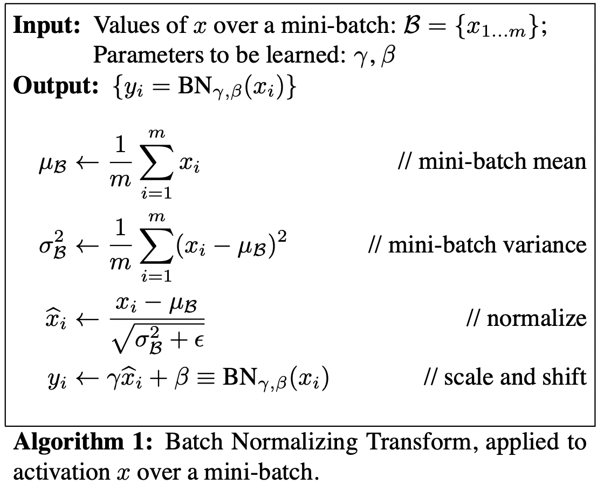
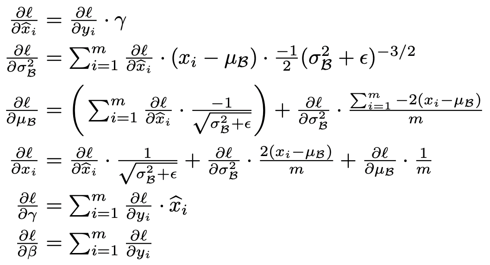

# Practical Aspects of Deep Learning

## Train/Validation/Test sets

1.  Its impossible to get all your hyperparameters right on a new application from the first time. So the idea is you go through the loop: Idea ==> Code ==> Experiment. You have to go through the loop many times to figure out your hyperparameters.
1. Your data will be split into three parts:
    * Training set. (Has to be the largest set)
    * Hold-out cross validation set / Development or "dev" set.
    * Testing set.
1. You will try to build a model upon training set then try to optimize hyperparameters on validation set as much as possible. Then after your model is ready, you try and evaluate the testing set.
1.  So, the general trend on the ratio of splitting the models:
    
    1. If size of the dataset is $100$ to $1000000$ ==> $60/20/20$
    1.  If size of the dataset is $1000000$ to $\inf$ ==> $98/1/1$ or $99.5/0.25/0.25$.

1. Make sure the validation and test set are coming from the same distribution.
For example, if cat training pictures is from the web and the validation/test pictures are from users cell phone, then they will mismatch. It is better to make sure that validation and test set are from the same distribution.
1.  The training error will generally increase as you increase the dataset size. This is because the model will find it harder to fit to all the datapoints exactly. Also, by increasing the dataset size, your validation (dev) error will decrease as the model would learn to be more generalized.

## Normalizing inputs

1. Normalizing a set of data transforms the set of data to be on a similar scale. For machine learning models, our goal is usually to recenter and rescale our data such that is between 0 and 1 or -1 and 1, depending on the data itself. 
    $$f(x) = \frac{x - \hat{x}}{\sigma}$$
    where $x$ represents a feature or attribute , $\hat{x}$ represents the mean of $x$ and $\sigma$ represents the standard deviation of $x$
1. Normalization can help training of our neural networks as the different features are on a similar scale, which helps to stabilize the gradient descent step, allowing us to use larger learning rates or help models converge faster for a given learning rate.

## Shuffling the dataset

## Should we shuffle the dataset before training ?

The obvious case where you'd shuffle your data is if your data is sorted by their class/target. Here, you will want to shuffle to make sure that your training/test/validation sets are representative of the overall distribution of the data. The idea behind batch gradient descent is that by calculating the gradient on a single batch, you will usually get a fairly good estimate of the "true" gradient. That way, you save computation time by not having to calculate the "true" gradient over the entire dataset every time.

## Should you shuffle the dataset after every epoch ?

[Source](https://datascience.stackexchange.com/questions/24511/why-should-the-data-be-shuffled-for-machine-learning-tasks)
1. Shuffling data serves the purpose of reducing variance and making sure that models remain general and overfit less.
1. You want to shuffle your data after each epoch because you will always have the risk to create batches that are not representative of the overall dataset, and therefore, your estimate of the gradient will be off. Shuffling your data after each epoch ensures that you will not be "stuck" with too many bad batches.

1. In regular stochastic gradient descent, when each batch has size $1$, you still want to shuffle your data after each epoch to keep your learning general. Indeed, if data point $17$ is always used after data point $16$, its own gradient will be biased with whatever updates data point $16$ is making on the model. 

1. By shuffling your data, you ensure that each data point creates an "independent" change on the model, without being biased by the same points before them.

# Batch Normalization

1. [Reference](https://mmuratarat.github.io/2019-03-09/batch-normalization)
1. [Paper](https://arxiv.org/pdf/1502.03167v3.pdf)

## Why

Typically, we train model in mini-batches. Initially, we make sure the input layer is zero centered and unit gaussian. But in the deep network, there is a possibility that the distributions of hidden layers may change which makes the learning process hard. That's why, Why not ensure that the pre-activations at each layer have similar distributions which makes the learninig easy. 

## Introduction

Batch Normalization will let the network decide what is the best distributions for it instead of forcing it to have zero mean and unit variance. This is usually applied with mini-batches. This is a co-variate shift. Training the model on different possible distributions of data. 

## Algorithm
Consider a mini-batch $B$ of size $m$. Since the normalization is applied to each activation independently, let us focus on a particular activation $x(k)$ and omit $k$ for clarity. We have $m$ values of this activation in the mini-batch. $B = {x_{1...m}}$.
Let the normalized values be $x_{1...m}$, and their linear transformations be $y1...m$. We refer to the transform 
    $$BN{\gamma,\beta} : x_{1...m} \rightarrow y_{1...m}$$
as the Batch Normalizing Transform.
In the algorithm, $\epsilon$ is a constant added to the mini-batch variance for numerical stability.

During training we need to backpropagate the gradi- ent of loss l through this transformation, as well as com- pute the gradients with respect to the parameters of the BN transform.

**Note**
1. $\gamma$ and $\beta$ are learnable parameters that are initialized with $\gamma=1$ and $\beta=0$.
1. Batch Normalization is done individually at every hidden unit. **The pairs ($\gamma^k$, $\beta^k$) are learnt per neuron**

## Batch Normalization in CNNs

1. For convolutional layers, we additionally want the normalization to obey the convolutional property – so that different elements of the same feature map, at different locations, are normalized in the same way. 
1. To achieve this, we jointly normalize all the activations in a mini-batch, over all locations. 
1. Let $B$ be the set of all values in a feature map across both the elements of a **mini-batch and spatial locations** – so for a mini-batch of size $m$ and feature maps of size $p \times q$, we use the effective mini-batch of size $\hat{m} = |B| = m \times pq$. We learn a pair of parameters $\gamma(k)$ and $\beta(k)$ per feature map, rather than per activation. 
1. During inference the BN transform applies the same linear transformation to each activation in a given feature map.

## Batch normalization at test time

Since the means and variances are fixed during inference, the normalization is simply a linear transform applied to each activation. It may further be composed with the scaling by $\gamma$ and shift by $\beta$, to yield a single linear transform that replaces $BN(x)$.

Exponentially weighted “moving average” can be used as global statistics to update population mean and variance:
$$\mu_{mov} = \alpha \mu_{mov}+(1-\alpha)\mu_\phi$$
$${\sigma^2}_{mov}==\alpha {\sigma^2}_{mov} + (1-\alpha){\sigma^2}_\phi$$
 
Here $\alpha$ is the “momentum” given to previous moving statistic, around $0.99$, and those with $\phi$ subscript are mini-batch mean and mini-batch variance.

## Where to Insert Batch Norm Layers?

Batch normalization may be used on the inputs to the layer before or after the activation function in the previous layer. It may be more appropriate after the activation function if for $S$-shaped functions like the hyperbolic tangent and sigmoid function. 

It may be appropriate before the activation function for activations that may result in non-Gaussian distributions like the rectified linear activation function, the modern default for most network types, as the authors of the original paper puts: ‘The goal of Batch Normalization is to achieve a stable distribution of activation values throughout training, and in our experiments we apply it before the nonlinearity since that is where matching the first and second moments is more likely to result in a stable distribution’.

## Advantages

1. Reduces internal covariate shift
1. Improves the gradient flow
1. More tolerant to saturating nonlinearities because it is all about the range of values fed into those activation functions.
1. Reduces the dependence of gradients on the scale of the parameters or their initialization (less sensitive to weight initialization)
1. Allows higher learning rates because of less danger of exploding/vanishing gradients.
acts as a form of regularization
1. All in all accelerates neural network convergence

## Don’t Use With Dropout
Batch normalization offers some regularization effect, reducing generalization error, perhaps no longer requiring the use of dropout for regularization. Further, it may not be a good idea to use batch normalization and dropout in the same network. The reason is that the statistics used to normalize the activations of the prior layer may become noisy given the random dropping out of nodes during the dropout procedure.

## Jaccard Index and Dice-coefficient
Also called as Intersection over Union. In case of segmentation task, where we want to assign a class to each pixel of the input image. Most likely, there exists huge class imbalance (i.e.) background pixels significantly greater than foreground pixels. In such cases accuracy is not a right metric. However, it's clearly not a good classifier although it might get $90\%$ accuracy. We would ideally want like a metric that is not dependent on the distribution of the classes in the dataset. For this reason, the most commonly used metric for segmentation is Intersection over Union (IoU) and Dice co-efficient (DSC). 
$$IOU(A,B) = \frac{\text{Area of Overlap}}{\text{Area of Union}} = \frac{A\cap B}{A \cup B}$$
$$DSC(A,B) = 2 \times \frac{A \cap B}{A + B}$$

# Effect of Hyperparameters

## Batch Size

1. It is well known that too large batch size will lead to poor generalization. On the one extreme, using a batch equal to the entire dataset guarantees convergence to the global optima of the objective function. However, this is at the cost of slower, empirical convergence to that optima.
1.  On the other hand, using smaller batch sizes have been empirically shown to have faster convergence to “good” solutions. This is intuitively explained by the fact that smaller batch sizes allow the model to “start learning before having to see all the data.” 
1. The downside of using a smaller batch size is that the model is not guaranteed to converge to the global optima. It will bounce around the global optima, staying outside some $\epsilon$-ball of the optima where $\epsilon$ depends on the ratio of the batch size to the dataset size.
1. We know a batch size of $1$ usually works quite poorly. It is generally accepted that there is some “sweet spot” for batch size between $1$ and the entire training dataset that will provide the best generalization. This “sweet spot” usually depends on the dataset and the model at question.

