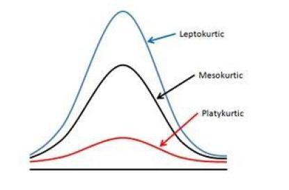

# Exploratory Data Analysis

## Pandas Skew() Function

[Medium Blog](https://medium.com/@atanudan/kurtosis-skew-function-in-pandas-aa63d72e20de)

### Introduction
Skewness is a measure of asymmetry of a distribution.
1. In a normal distribution, the mean divides the curve symmetrically into two equal parts at the median and the value of skewness is zero.
1. When a distribution is asymmetrical the tail of the distribution is skewed to one side-to the right or to the left.
1. When the value of the skewness is negative, the tail of the distribution is longer towards the left hand side of the curve.
1. When the value of the skewness is positive, the tail of the distribution is longer towards the right hand side of the curve

### Formula
[Reference](https://study.com/academy/lesson/skewness-in-statistics-definition-formula-example.html)

$$skewness = (3 * (mean - median)) / standard deviation$$

### Note
1. If the skewness is between $-0.5$ and $0.5$, the data are fairly symmetrical
1. If the skewness is between $-1$ and $-0.5$ or between $0.5$ and $1$, the data are moderately skewed
1. If the skewness is less than $-1$ or greater than $1$, the data are highly skewed

## Kurtosis
[Medium Blog](https://medium.com/@atanudan/kurtosis-skew-function-in-pandas-aa63d72e20de)
### Introduction
Kurtosis is one of the two measures that quantify shape of a distribution. 

1. Kurtosis describes the peakedness of the distribution. It is the sharpness of the peak of a frequency-distribution curve. 

1. If the distribution is tall and thin it is called a leptokurtic distribution(Kurtosis > 3). Values in a leptokurtic distribution are near the mean or at the extremes.
1. A flat distribution where the values are moderately spread out (i.e., unlike leptokurtic) is called platykurtic(Kurtosis <3) distribution.

1. A distribution whose shape is in between a leptokurtic distribution and a platykurtic distribution is called a mesokurtic(Kurtosis=3) distribution. A mesokurtic distribution looks more close to a normal distribution.

### Formula 
[Reference](https://stats.libretexts.org/Bookshelves/Probability_Theory/Probability_Mathematical_Statistics_and_Stochastic_Processes_(Siegrist)/04%3A_Expected_Value/4.04%3A_Skewness_and_Kurtosis)

The kurtosis of $X$ is the fourth moment of the standard score:
$$kurt(𝑋)=𝔼 \left[ {\left( \frac{𝑋−\mu}{\sigma} \right)}^4 \right]$$

### Note

It is actually the measure of outliers present in the distribution.
1. High kurtosis --> Heavy outliers.
1. Low kurtosis --> lack of outliers.

If kurtosis value (>0) means pointy and (<0) means flat.