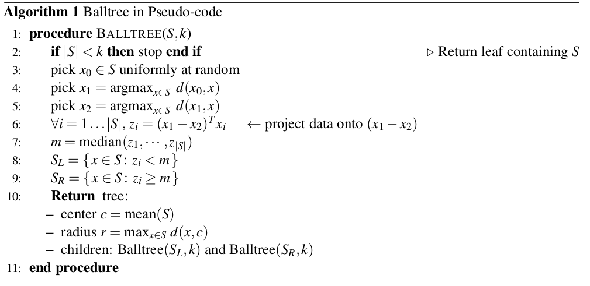
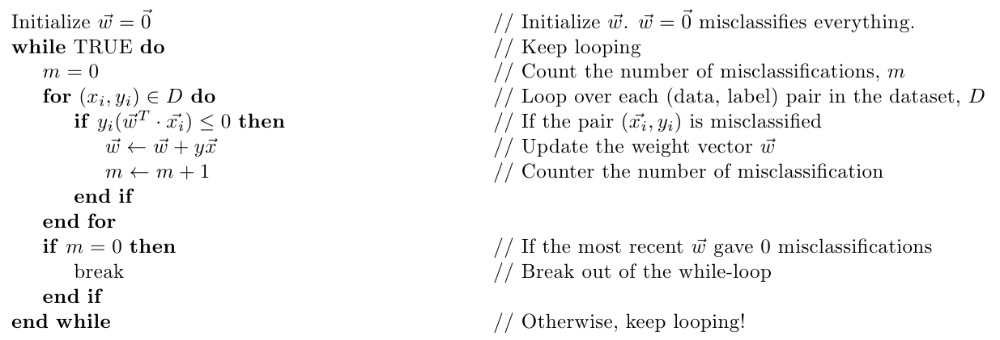
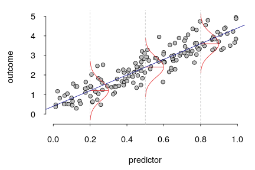
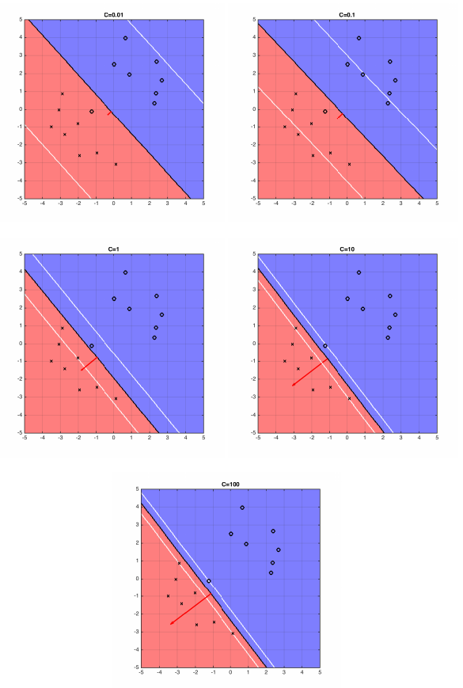
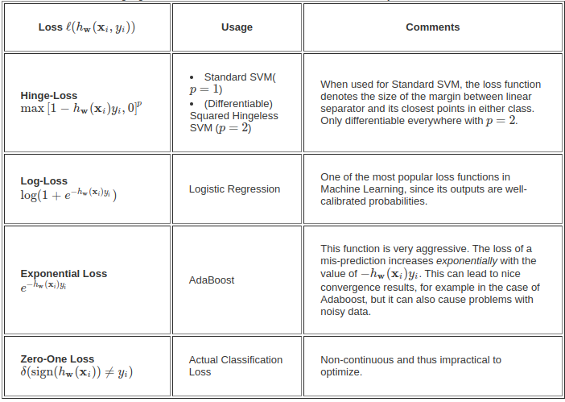
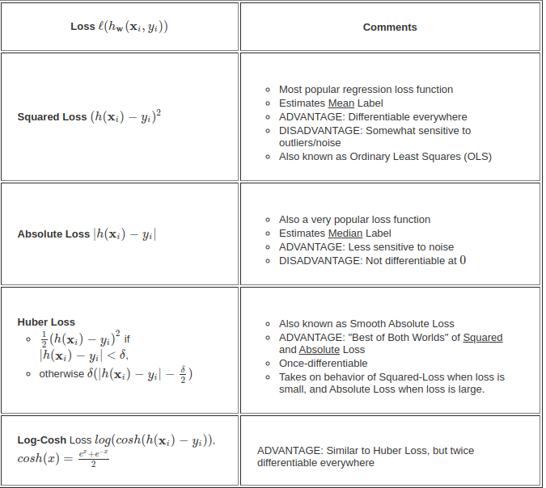
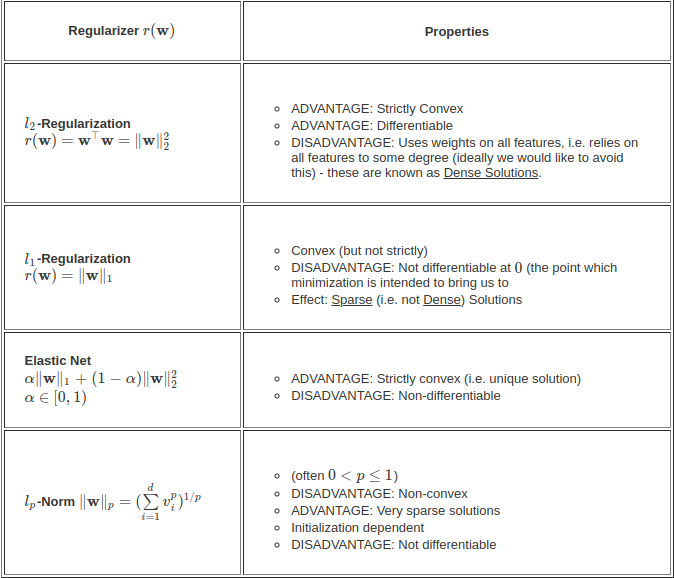
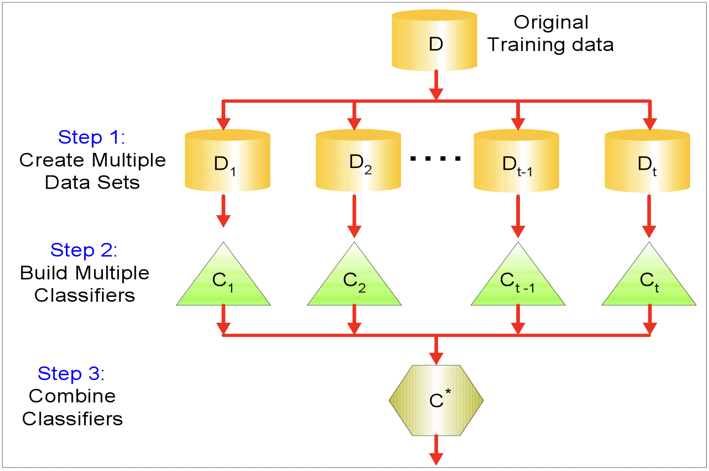
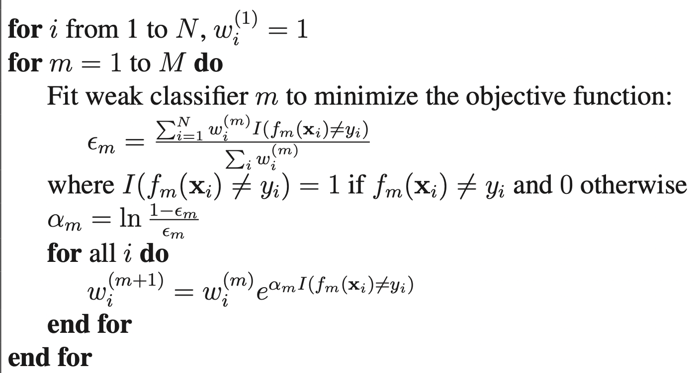
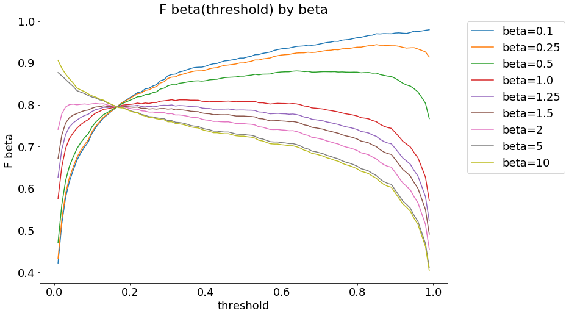

# Supervised Machine Learning Algorithms

The goal is, given a training set, to learn a function $h : X \rightarrow Y$ so that $h(x)$ is a “good” predictor for the corresponding value of $y$. For historical reasons, this function $h$ is called a hypothesis.

## KNN Algorithm

### Assumption

Similar Inputs have similar outputs which imply that data points of various classes are not randomly sprinkled across the space, but instead appear in clusters of more or less homogeneous class assignments.

### Classification rule

For a test input x, assign the most common label amongst its k most similar training inputs.

### What distance function should we use to find neighbors?

The k-nearest neighbor classifier fundamentally relies on a distance metric. The better that metric reflects label similarity, the better the classified will be. 

1. Minkowski distance between two points $x$ and $x'$: $$D(x, x') = {(\sum_{i=1}^d {(x'_i - x_i)^p})}^\frac{1}{p}$$
where '$d$ represents the number of dimensions. The most common choice is the 
    1.  $p = 1$  (Manhattan distance)
    1.  $p = 2$  (Euclidean distance)
    1.  $p = \infty$ (Max of difference between coordinates in each dimension)

1. Cosine Similarity :
$$Cosine Similarity(x, x') = \frac{x.x'}{|x||x'|}$$
Generally, incase of classification of documents(bag of words), then it is better to consider cosine similarity.

**Note : We need to choose distance metric wisely based on our problem**

### How to choose k

1.  Generally we go for odd k. 
1.  In case of multi class classification with four classes C1, C2, C3, C4 with distribution of (say k = 7) nearest neighbors (3,3,1,0), If C1 and C2 have same number of neighbors, then we can check all its majority classes and assign that class which contains the closest point.  

### What if $k = n$

Then the output of all test points will be same as major class in the given data set irrespective of its input. Therefore, never ever choose $k = n$.

### What if $k = 1$

1.  The 1-NN could be an outlier of some another class. Then it miss-classifies the point. Therefore, its better not to choose. 
1.  As $n\rightarrow \infty$, the 1-NN(1 Nearest Neighbor) classifier is only a factor 2 worse than the best possible classifier. 

1.  Let $x_{NN}$ be the nearest neighbor of our test point $x_t$. As $n\rightarrow \infty, 
dist(x_{NN},x_{t}) \rightarrow 0, (i.e.) x_{NN} \rightarrow x_t$. (This means the nearest neighbor is identical to $x_t$.) You return the label of $x_{NN}$. What is the probability that this is not the label of $x_t$? (This is the probability of drawing two different label of x). Solving this probability, we reach to the above conclusion. 

### Curse of Dimensionality

1.  As the dimension $d$ of the input increases, the distance between two points in the space also increases. 
1.  So as $d >> 0$ almost the entire space is needed to find the 10-NN. 
1.  This breaks down the k-NN assumptions, because the k-NN are not particularly closer (and therefore more similar) than any other data points in the training set. Why would the test point share the label with those k-nearest neighbors, if they are not actually similar to it?
1.  Dont try to visualize the above point as it involves multiple dimensions greater than three. Do the math.
1.  Note : In real life, points are not uniformly distributed. Points mostly lie on the complex manifolds and may form clusters. That's why KNN may work sometimes even for higher dimensions. 

### Pros and Cons

Pros :
1.  Easy and simple 
1.  Non parametric 
1.  No assumption about data. 
1.  Only two choices (k values and distance metric).

Cons : 
Computation time : O(N.d) where N -> #training samples and d -> #dimensions.

### K Dimensional Tress (KD Trees)

1.  Building KD trees. 

    1. Split data recursively in half on exactly one feature.
    1. Rotate through features.
        1. When rotating through features, a good heuristic is to pick the feature with maximum variance.

    Max height of the tree could be $log_2(n)$.

1. Finding NN for the test point(X,y). 

    1. Find region containing (x,y). 
    1. Compare to all points in the region.

1.  How can this partitioning speed up testing?

    1.  Let's think about it for the one neighbor case.
    1.  Identify which side the test point lies in, e.g. the right side.
    1.  Find the nearest neighbor ${x_{NN}}^R$ of $x_t$ in the same side. The $R$ denotes that our nearest neighbor is also on the right side.
    1.  Compute the distance between $x_y$ and the dividing "wall". Denote this as $d_w$. If $d_w>d(x_t,{x_{NN}}^R)$ you are done, and we get a $2\times$ speedup.

1.  Pros: Exact and  Easy to build.
1.  Cons:
    1.  Curse of Dimensionality makes KD-Trees ineffective for higher number of dimensions. May not work better if dimensions are greater than 10. 
    1.  All splits are axis aligned (all dividing hyperplanes are parallel to axis).

1.  Approximation: Limit search to $m$ leafs only. 

### Ball Trees

1.  Similar to KD-trees, but instead of boxes use hyper-spheres (balls). If the distance to the ball, $d_b$, is larger than distance to the currently closest neighbor, we can safely ignore the ball and all points within.

1. The ball structure allows us to partition the data along an underlying manifold that our points are on, instead of repeatedly dissecting the entire feature space (as in KD-Trees).

1. Ball trees allows us to split along the dimension with maximum variance instead of splitting along the feature axis in half. 

1.  Construction :

    

1.  Ball-Tree Use : 
    1.  Same as KD-Trees
    1.  Slower than KD-Trees in low dimensions (d≤3) but a lot faster in high dimensions. Both are affected by the curse of dimensionality, but Ball-trees tend to still work if data exhibits local structure (e.g. lies on a low-dimensional manifold).

### Locally sensitive hashing (LSH) 
    
1. Divide the whole space of points into $\frac{n}{2^k}$ regions by randomly drawing k hyperplanes $(h_1, h_2, h_3, ........., h_k)$. 
1. Compare $x$ to only those $\frac{n}{2^k}$ points in that particular region. 
1. Complexity : $O(Kd +  d \frac{n}{2^k})$. 
    1. Kd : To find out which point belongs to which region. For that we need to check with each hyperplane and find that. 
    1. $d\frac{n}{2^k}$ : Finding the NN by comparing d-dimensional point with $\frac{n}{2^k}$ points. 
1. Limitations : Choosing the right set and number of hyperplanes are really important. Try a couple of different initializations. Based on the way we choose the hyperplanes, we may miss out the main neighbors and misclassify the point. 
    
### Conclusion

1.  KNN is best suitable if dimensions are low and high number of data points. 
1.  KNN works better incase of images and faces though the data is highly dimensoinal due to its sparsity. Moreover, similar points similar labels assumption kind of stays true.
1.  More the number of data points, slow is the algorithm. 

## Perceptron Algorithm

### Basic Understanding
The hyperplane separates the two classes. The hyperplane is found by finding its weights. 
$$h(x_i) = sign({w^⊤}{x_i} + b) \rightarrow eq(1) $$  
Based on which side of hyperplane the point lies, its class is decided. 
The pseudo code of the algorithm is given below.

Here, we include bias in the weight vector itself by adding an extra dimension of constant 1 in the input. 

The update $w = w + yx$ moves the w vector(hyperplane) in direction of x. Proof : 
After updating the w, $(w + yx_i)^T{x_i} = w^Tx + y{x^T}x$. Let this equation be eq(2). Here two cases : 

1.  In case of false positive : y = 0, eq(1) > 0, we need to decrease its value so that it becomes less than 0. By updating the weight vector, it reduces the eq(1) by $x^T.x$ amount. 
1.  Quite opposite is the case with false negative. 

### Assumptions

1.  Binary classification (i.e. $y_i \in \{-1,+1\}$)
1.  Data is linearly separable

### Perceptron Convergence
If the data is linearly separable, then the algo will converge definitely, otherwise the algo will loop infinetly and will never converge. [Proof](https://www.youtube.com/watch?v=vAOI9kTDVoo&list=PLEAYkSg4uSQ1r-2XrJ_GBzzS6I-f8yfRU&index=16)

## Generative Learning algorithms

### Intro

1.  Algorithms that try to learn $p(y|x)$ directly (such as logistic regression),
or algorithms that try to learn mappings directly from the space of inputs $X$ to the labels $\{0, 1\}$, (such as the perceptron algorithm) are called discriminative learning algorithms.
1.  Algorithms that instead try to model $p(x|y)$ are generative learning algorithms.
1.  For instance, if $y$ indicates whether an example is a dog $(0)$ or an elephant $(1)$, then $p(x|y = 0)$ models the distribution of dogs features, and $p(x|y = 1)$ models the distribution of elephants features.

### Gaussian Discriminant Analysis

1.  In this model, we’ll assume that $p(x|y)$ is distributed according to a multivariate normal distribution.

1.  This Algorithm make use of Bayes theorem to model $p(y|x)$. 
    $$ p(x; \mu, \Sigma) = \sqrt{\frac{1}{{(2 \pi)}^n det(\Sigma)}} exp(-\frac{1}{2}(x-\mu)^T\Sigma^{-1}(x-\mu))$$ 
    Here, $\Sigma$ = Covariance of X. 
    Here, $\mu$ and $\Sigmais computed for each class inputs separately.
    $$y \approx Bernoulli(\phi)$$ 

    $$x|y = 0 \approx N(\mu_0, \Sigma_0)$$ 

    $$x|y = 1 \approx N(\mu_1, \Sigma_1)$$ 

    $$p(x; \mu_0, \Sigma_0) = \sqrt{\frac{1}{{(2 \pi)}^n det(\Sigma_0)}} exp(-\frac{1}{2}(x-\mu_0)^T \Sigma_0^{-1}(x-\mu_0))$$

    $$p(x; \mu_1, \Sigma_1) = \sqrt{\frac{1}{{(2 \pi)}^n det(\Sigma_1)}} exp(-\frac{1}{2}(x-\mu_1)^T\Sigma_1^{-1}(x-\mu_1))$$

1. The log-likelihood of the data is given
by 
    $$l(\phi, \mu_0, \mu_1,\Sigma_0, \Sigma_1) = log {\prod^m}_{i=1} p(x(i), y(i); \phi, \mu_0, \mu_1, \Sigma_0, \Sigma_1)$$

    $$l(\phi, \mu_0, \mu_1,\Sigma_0, \Sigma_1) = log {\prod^m}_{i=1} p(x(i)| y(i); \phi, \mu_0, \mu_1, \Sigma_0, \Sigma_1) \times p(y(i);\phi)$$ 
    
    By maximizing $l$ with respect to the parameters, we find the maximum likelihood estimate of the parameters (see problem set 1) to be:

    $$\phi =\frac{1}{m}\sum_{i=1}^m 1\{y(i) = 1\}$$

    $$\mu_0 = \frac{\sum^m_{i=1} 1\{y(i) = 0\} x(i)}{\sum^m_{i=1} 1\{y(i) = 0\}}$$

    $$\mu_1 = \frac{\sum^m_{i=1} 1\{y(i) = 1\}x(i)}{\sum^m_{i=1} 1\{y(i) = 1\}}$$

$$ \Sigma_{y^(i)} = \frac{1}{m} \sum^m_{i=1} (x(i) - \mu_{y^(i)})(x(i) - \mu_{y^(i)})^T $$

1. **GDA vs Logistic Regression** : 
GDA works best if X distribution is multivariate. But Logistic Regression works best even for other distributions also. 

## Naive Bayes Classifier

[Source](https://www.cs.cornell.edu/courses/cs4780/2018fa/lectures/lecturenote05.html)

### Introduction

1.  In GDA, the feature vectors $X$ were continuous, real-valued vectors. 
1.  Naive Bayes is different learning algorithm in which the $x_j$ ’s are discrete-valued.
1.  This algorithm is mostly used in case of text because words are discrete. 
1.  Naive Bayes works best if we have very less data. 
1.  It tries to model the data and finds out the parameters for the distributions of the classes and based on those parameters, it predicts the new data point.
1.  This is extremely fast because there is no loop or anything. Just need to find out the parameters for the class distributions.
1.  Naive Bayes is a linear classifier. You can find that proof in [Cornell lec 11](https://www.youtube.com/watch?v=GnkDzIOxfzI) in first 10 mins. 

### Assumptions

All the discrete features are independent of each other given the label.

### Classifier

In case of a binary classifier, $y \in \{0,1\}$ and $X : X_{M\times N}$.  
$$P(X|Y = 0) = P(X_1|Y = 0) \times P(X_2|Y = 0) ........... \times P(X_N|Y = 0) \rightarrow \text{Features are independent}$$
$$P(X|Y = 1) = P(X_1|Y = 1) \times P(X_2|Y = 1) ........... \times P(X_N|Y = 1) $$
Using the Bayes theorem, we can find $P(Y|X)$. 

### Note

Even if the naive bayes assumption violates, this algo works very well. If the naive Bayes assumption holds, then Naive Bayes works similar to Logitstic Regression. [Proof](https://www.cs.cornell.edu/courses/cs4780/2018fa/lectures/lecturenote05.html) 

My Comments : This is easy. Watch [Krish Naik Video](https://www.youtube.com/watch?v=jS1CKhALUBQ) for intution and watch [Cornell Video](https://www.youtube.com/watch?v=rqB0XWoMreU) for in-depth understanding.

## Linear Regression
Source -> [Stanford notes](https://see.stanford.edu/materials/aimlcs229/cs229-notes1.pdf)

### Introduction

1.  In Linear Regression, We try to fit the data to a linear function. Let y as a linear function of x:
    $$h_{\theta}(x) = {\theta}_0 + {\theta}_1x_1 + {\theta}_2x_2$$
1.  Here the output is continuous value. $y \in \Re$
1.  To simplify our notation, we also introduce the convention of letting $x_0 = 1$ (this is the intercept term), so that
    $$ h(x) = {\Sigma_{i=0}}^m \theta_i x_i = \theta^T x$$
1.  Our objective is to make h(x) close to y, at least for
the training examples we have. Therefore, we try to minimize the loss function :
    $$J(\theta) = \frac{1}{2} {\sum_{i=0}}^m (h_\theta(x^i) - y^i)^2 $$

Note : We can go for the different loss function, that is absolute loss(MAE), power 4 etc. 
MAE is not differentiable at 0. Power4 or any other even power function penalizes the outliers very much and also those turns out to be non-convex function. 

### Minimization of Loss Function

1.  We want to choose $\theta$ so as to minimize $J(\theta)$.
1.  Let’s consider the gradient descent
algorithm, which starts with some initial θ, and repeatedly performs the update:
    $$ \theta_j := \theta_j - \alpha \frac{\partial J}{\partial \theta_j}$$
    where $\alpha$ is the learning rate.
1. This equation is derived from Taylor series. To understand the above equation in more depth, watch this Taylor series [3-Blue-1-Brown Video](https://www.youtube.com/watch?v=3d6DsjIBzJ4&t=295s)
1.  The linear regression algorithm that we saw earlier is known as a parametric learning algorithm, because it has a fixed, finite number of parameters (the $\theta_i$’s), which are fit to the data. Once we’ve fit the $\theta_i$’s and stored them away, we no longer need to
keep the training data around to make future predictions.

### Assumptions

1.  Linearity: The relationship between $X$ and the mean of $Y$ is linear.
1.  Independence: Observations are independent of each other.(Independent and Identical distribution $I.I.D$).
1.  Normality: For any fixed value of $X$, $Y$ is normally distributed.
1. Homoscedasticity: 
    * The variance of residual is the same for any value of $X$. In below figure, variance of $Y$ (actual value) at every $X$ value is same. 

    The blue regression lines connects the fitted y-values at each x-value and is assumed to be straight(*1^{st} assumption*). The red density curves visualise that the model assumes the y-data at each x-value to be normally distributed(*$3^{rd}$ assumption*) with the same variance (*$4^{th}$ assumption*) at different x-values.

    

### Normal method to minimize the loss (*Linear Regression Closed form Solution*)

1. X ~ $[]_{m\times n}$  and y ~ $[]_{m\times 1}$.
1. We have to minimize $$J = \frac{1}{2} (X\theta - y)^T (X\theta - y)$$
1. Therefore, $\nabla_\theta J = 0$. 
After differentating the J, we get $$\theta = {(X^TX)}^{-1}X^TY$$ 
(Refer to [stanford notes](https://see.stanford.edu/materials/aimlcs229/cs229-notes1.pdf) for proof in detail.)
1. Using the property $$ \nabla_{A^T} trABA^TC = B^TA^TC^T + BA^TC $$

### Probabilistic Interpretation

1. When faced with a regression problem, why might linear regression, and specifically why might the least-squares cost function J, be a reasonable choice?

1.  Let us assume that the target variables and the inputs are related via the equation $$y(i) = \theta^T x(i) + \epsilon(i)$$
where $\epsilon(i)$ is an error term.

1.  Assumptions :

    1.  $\epsilon(i)$ are distributed $I.I.D$ (Independently and Identically distributed).
    1.  $\epsilon(i) \approx N(0, \sigma^2)$ . This is same as $y_i\approx N(w^Tx_i, \sigma^2)$
    1.  $\sigma^2 = 1$ This doesn't effect the calculation

1.  Therefore, $$ p(\epsilon) =  \mathcal{N}(x; 0, 1) = \sqrt{\frac{1}{2 \pi}} exp(-\frac{1}{2}\epsilon^2)$$

This implies that , $$ p(y^i|x^i;\theta) = \sqrt{\frac{1}{2 \pi}} exp(-\frac{1}{2}(y^i - \theta^T x^i)^2)$$
Try to maximize the log likelihood. 

## Locally weighted Linear regression

### Why

Sometimes we cannot fit a straight line to the whole data. In those cases, if we consider only few datapoints near to the point we wanted to estimate, we may fit the line to those points in the neighborhood of that points. 

### How

1. To do so, we assign more weight to the points near to the test point and less weight to points far from it. 

1. Each time we want to predict $y$ for a test point $x'$, we need to fit the line to points near to $x'$. 

1. Assigning weights will be done using the formula : $$w(i) = exp[-\frac{(x(i) - x')^2}{\tau^2}]$$

1. Fit $\theta$ to minimize $$\sum_i w(i).[y(i) - \theta^T x(i)]^2$$

1. The bandwidth parameter $\tau$ controls how quickly the weight of a training example falls off with distance of its $x(i)$ from the query point $x$;

1. This is **non-parametric** learning algorithm (i,e) to
make predictions using locally weighted linear regression, we need to keep
the entire training set around.

## Logistic Regression(LR)

[Stanford notes](https://see.stanford.edu/materials/aimlcs229/cs229-notes1.pdf)

### Introduction

1. This is used for classification.
1. This is same as Linear regression, but as we need to classify, we need discrete outputs not continuous. Therefore, we use sigmoid function at the end.  $$h_\theta(x) = \text{Sigmoid}(\theta^T x) = \frac{1}{1 + e^{-\theta^T x}}$$
1.  Here sigmoid gives the probability of that training example belonging to **class 1**. 

### Minimization of Loss Function

1. We want to choose $\theta$ so as to minimize $J(\theta)$.
1. To minimize $J$, we find out its derivative and surprisingly, derivative will end up as same as in case of linear regression. 
1. Let’s consider the gradient descent
algorithm, which starts with some initial $\theta$, and repeatedly performs the update: $$ \theta_j := \theta_j - \alpha \frac{\partial J(\theta)}{\partial \theta_j}$$
1. If different features have different scales, then the loss is dominated by large scale features. 

### Probabilistic Interpretation

1.  Here in case of binary classification, the outputs have the bernoulli distribution ($0$ and $1$) and in case of multi class classification,  they have multinouli distribution. 
1.  Binary classification :  $$P(y = 1 | x; θ) = h_\theta(x)$$ $$P(y = 0 | x; θ) = 1 - h_\theta(x)$$ $$p(y | x; \theta) = (h_\theta(x))^y (1 - h_\theta(x))^{1-y}$$
1. Assuming that the $m$ training examples were generated independently, we can then write down the likelihood of the parameters as $$L(\theta) = p(~y | X; \theta)=\Pi_{i=1}^{^m} p(y(i) | x(i); \theta)$$ We try to maximize the log-likelihood function. 
In this process, we end up finding the Cross Entropy loss function. 

## Generalized Linear models

[Stanford notes](https://see.stanford.edu/materials/aimlcs229/cs229-notes1.pdf)

### Intro

1.  We’ve seen a regression example, and a classification example. In the regression example, we had $y|x; \theta \approx N(\mu, \sigma^2)$, and in the classification one, $y|x; \theta \approx Bernoulli(\phi)$, for some appropriate definitions of $\mu$ and $\phi$ as functions
of $x$ and $\theta$. In this section, we will show that both of these methods are special cases of a broader family of models, called Generalized Linear Models (GLMs).

1. We say that a class of distributions is in the exponential family if it can be written in the form $$p(y; \eta) = b(y) exp(\eta^T T(y) - a(\eta))$$
    1. $\eta$ - the natural parameter (also called the canonical parameter) of the distribution; 
    2. $T(y)$ - sufficient statistic (for the distributions we consider, it will often be the case that $T(y) = y$)
    3. $a(\eta)$ - log partition function. The quantity $e^{-a(\eta)}$ essentially plays the role of a normalization constant, that makes sure the distribution $p(y; \eta)$ sums/integrates over $y$ to $1$.

1. A fixed choice of $T$, $a$ and $b$ defines a family (or set) of distributions that is parameterized by $\eta$; as we vary $\eta$, we then get different distributions within
this family.

### Distributions in Exponential Family

1.  Bernoulli
1.  Gaussian
1.  Multinoulli

### Bernoulli

1. The Bernoulli distribution with
mean $\phi$, written Bernoulli($\phi$), specifies a distribution over $y \in {0, 1}$, so that $$p(y = 1; \phi) = \phi; p(y = 0; \phi) = 1 - \phi$$

1. As we vary $\phi$, we obtain Bernoulli distributions with different means. We now show that this class of Bernoulli distributions, ones obtained by varying φ, is in the exponential family; i.e., that there is a choice of T, a and b so that above equation becomes exactly the class of Bernoulli distributions. $$p(y; \phi) = \phi^y (1 - \phi)^{1-y} = exp(y log \phi + (1 - y) log(1 - \phi)) $$ $$= exp ((log(\frac{\phi}{1 - \phi}))y + log(1 - \phi))$$
1.  Thus, the natural parameter is given by $\eta = log(\frac{\phi}{(1 - \phi)})$. Interestingly, if
we invert this definition for $\eta$ by solving for $\phi$ in terms of $\eta$, we obtain $ \phi = 1/(1 + e^{-\eta})$. This is the familiar sigmoid function!

1.  The formulation of the Bernoulli distribution as an exponential family distribution,
    $$T(y) = y$$
    $$a(\eta) = -log(1 - \phi) = log(1 + e^{\eta}) - \eta$$
    $$b(y) = 1$$

### Gaussian

1.  When deriving linear regression, the value of $\sigma^2$ had no effect on our final choice of $\theta$ and $h_\theta(x)$.To simplify the derivation below, let’s set $\sigma^2 = 1$. 
$$ p(y;\mu) = \frac{1}{\sqrt(2\pi)} exp(-\frac{1}{2}(y-\mu)^2) = \frac{1}{\sqrt(2\pi)} exp(-\frac{1}{2}y^2 ) exp(\mu y - \frac{1}{2} \mu^2)$$

1.  $\eta = \mu$, 
$T(y) = y$,
$a(\eta) = \frac{\mu^2}{2}$
$b(y) = \frac{1}{\sqrt(2\pi)} exp(−\frac{y^2}{2})$.
1.  If we leave $\sigma^2$ as a variable, the Gaussian distribution can also be shown to be in the
exponential family, where $\eta \in \Re^2$ is now a 2-dimension vector that depends on both $\mu$ and $\sigma$. 

1.  For the purposes of GLMs, however, the $\sigma^2$ parameter can also be treated by considering a more general definition of the exponential family: $$p(y;\mu, \sigma^2 ) = b(a, \tau ) exp((\eta^T T(y) - a(\eta))/c(\tau))$$

1.  Here, $\sigma^2$ is called the dispersion parameter, and for the Gaussian, $c(\tau) = \sigma^2$; but given our simplification above, we won’t need the more general definition for the examples we will consider here.

### Multinoulli
1.  Consider a classification problem in which the response variable y can take on any one of k values, so $y \in {1, 2, . . . , k}$.

1.  To parameterize a multinomial over k possible outcomes, one could use
k parameters $\phi_1, . . . , \phi_k$ specifying the probability of each of the outcomes.

1.  These parameters would be redundant, or more formally, they would not be independent (since knowing any k-1 of the $\phi_i$’s uniquely determines the last one, as they must satisfy $\sum_{i=1}^k \phi_i = 1)$

1.  So, we will instead parameterize the multinomial with only k-1 parameters, $\phi_1, . . . , \phi_{k-1}$

1.  To express the multinomial as an exponential family distribution, we will define $T(y) \in \Re^{k-1}$ as follows:
T(1) = [1 0 0 .....0] T(2) = [0 1 0 0 ... 0] .... T(k) = [0 0 0 ..... 0 ]

1.  We will write $(T(y))_i$ to denote the i-th element of the vector T(y).
$(T(y))_i = 1{y = i}$(if condition is true, it returns 1 otherwise 0).
$$p(y;\phi) = \phi_{1}^{1\{y=1\}} \phi_{2}^{1\{y=2\}}...... \phi_{k}^{1\{y=k\}}$$ 
$$p(y;\phi) = \phi_{1}^{1\{y=1\}} \phi_{2}^{1\{y=2\}}...... \phi_{k}^{1 - \sum_{i=1}^{k} 1\{y=k\}}$$ 

Using $e^{logN} = N$ and $(T(y))_i = 1\{y = i\}$ and simplify :  $$p(y;\phi) = exp((T(y))_{1} log(\frac{\phi_{1}}{\phi_k}) + (T(y))_{2} log(\frac{\phi_{2}}{\phi_k}) +........ + (T(y))_{k-1} log(\frac{\phi_{k−1}}{\phi_k}) + log(\phi_k))$$
$$p(y; \eta) = b(y) exp(\eta^T T(y) - a(\eta))$$
where  $$\eta = [log(\frac{\phi_{1}}{\phi_k}) log(\frac{\phi_{2}}{\phi_k}) ....... log(\frac{\phi_{k-1}}{\phi_k})]^T $$
$$a(\eta) = -log(\phi_k)$$
$$b(y) = 1$$

The link function is given (for i = 1, . . . , k) by
$$\eta_i = log((\frac{\phi_{i}}{\phi_k})) $$

We need to find the response function, $\phi_i$. 
Using $\phi_1 + \phi_2 + .... + \phi_k = 1 $ to give response function : $$\phi_i = \frac{e^{\eta_i}}{\sum_{j=1}^k e^{\eta_j}} $$

This function mapping from the $\eta$’s to the $\phi$’s is called the softmax function.

## Support Vector Machines(SVM)

1.  Consider a positive training example ($y = 1$). The larger $\theta^T x$ is, the larger also is $h(x) = p(y = 1|x;w, b)$, and thus also the higher our degree of “confidence” that the label is 1.

1.  Again informally it seems that we’d have found a good fit to
the training data if we can find $\theta$ so that $\theta^T x(i) >> 0$ whenever y(i) = 1, and $\theta^T x(i) << 0 $ whenever $y(i) = 0$, since this would reflect a very confident (and correct) set of classifications for all the training examples.

1. We’ll use $y \in \{-1, 1\}$ (instead of $\{0, 1\}$) to denote the class labels. $$h_{w,b}(x) = g(w^T x + b)$$
Here, $g(z) = 1$ if $z \geq 0$, and $g(z) = -1$ otherwise.
$w$ takes the role of $[\theta_1, . . . ,\theta_n]^T$ and $b$ is 
intercept term.

1. Note also that, from our definition of $g$ above, our classifier will directly predict either $1$ or $-1$, without first going through the intermediate step of estimating the probability of $y$ being $1$.

1. Given a training example ($x(i), y(i)$), we define the functional margin of ($w, b$) with respect to the training example $$\gamma(i) = y(i)(w^T x(i) + b)$$ 

1. If $y(i)(w^T x(i) + b) > 0$, then our prediction on this example is correct.

1. Given our choice of $g$, we note that if we replace $w$ with $2w$ and b with $2b$, then since $g(w^Tx+b) = g(2w^Tx+2b)$,this would not change $h_{w,b}(x)$ at all. (i.e.), $g$, and hence also $h_{w,b}(x)$, depends only on the sign, but not on the magnitude of $w^T x + b$. However, replacing $(w, b)$ with $(2w, 2b)$ also results in multiplying our functional margin by a factor of $2$.

1. Intuitively, it might therefore make sense to impose some sort of normalization condition such as that $||w||_2 = 1$ i.e., we might replace $(w, b)$ with $(w/||w||_2, b/||w||_2)$.

1. Given a training set $S = \{(x(i), y(i)); i = 1, . . . ,m\}$, we also define the functional margin of $(w, b)$ with respect to $S$ as the smallest of the functional margins of the individual training examples $$\hat{\gamma}(i) = min_{i=1,...,m} \gamma(i)$$

1. Geometric Margins : The geometric margin of $(w, b)$ with respect to a training example $(x(i), y(i))$ to be $$\hat{\gamma}(i) = y(i)(\frac{w^T}{||w||} x(i) + \frac{b}{||w||})$$

1. Note that if $||w|| = 1$, then the functional margin equals the geometric margin — this thus gives us a way of relating these two different notions of margin.

1.  Specifically, because of this invariance to the scaling of the parameters, when trying to fit $w$ and $b$ to training data, we can impose an arbitrary scaling constraint on $w$ without changing anything important; for instance, we can demand that $||w|| = 1$, or $|w1| = 5$, or $|w1 + b| + |w2| = 2$, and any of these can be satisfied simply by rescaling $w$ and $b$.

### Objective 

$$max_{w,b} \gamma$$ 
s.t  $y(i)(w^T x(i) + b) \geq \hat{\gamma}$, for  $i = 1, . . . ,m$ and $||w|| = 1$ 

1. (i.e.), we want to maximize $\gamma$, subject to each training example having functional margin at least $\hat{\gamma}$. The $||w|| = 1$ constraint moreover ensures that the
functional margin equals to the geometric margin, so we are also guaranteed that all the geometric margins are at least $\hat{\gamma}$.

1. If we could solve the optimization problem above, we’d be done. But the “$||w|| = 1$” constraint is a nasty (non-convex) one, and this problem certainly
isn’t in any format that we can plug into standard optimization software to
solve. So, let’s try transforming the problem into a nicer one $$max_{w,b} \frac{\gamma}{||w||}$$
s.t. $y(i)(w^T x(i) + b) \geq \hat{\gamma}$ for  $i = 1, . . . ,m$.

1. Here, we’re going to maximize $\frac{\hat{\gamma}}{||w|}$, subject to the functional margins all being at least $\hat{\gamma}$. Recall our earlier discussion that we can add an arbitrary scaling constraint on $w$ and $b$ without changing anything. This is the key idea we’ll use now.

1. We will introduce the scaling constraint that the
functional margin of $w$, $b$ with respect to the training set must be $1$: $$\hat{\gamma} = 1$$

1. Since multiplying $w$ and $b$ by some constant results in the functional margin being multiplied by that same constant, this is indeed a scaling constraint, and can be satisfied by rescaling $w, b$. Plugging this into our problem above,
and noting that maximizing $$\frac{\gamma^\wedge}{||w||} = \frac{1}{||w||}$$ is the same thing as minimizing $||w||^2$, we now have the following optimization problem: $$min_{w,b} ||w||^2$$
s.t. $y(i)(w^T x(i) + b) \geq 1$ for  $i = 1, . . . ,m$ 
1. The above is an optimization problem with a convex quadratic objective and only linear constraints. Its solution gives us the optimal margin classifier.

*Note : The mathematical derivation of SVM can be found [here](https://iiitaphyd-my.sharepoint.com/:b:/g/personal/krishna_chandra_research_iiit_ac_in/EWGaLL7gMy9Ht68sJW--RmgBP8n5wbJ2TALp2bFNLRtQ_g?e=G7vngX)
and the clarity will be given in [cornell lec14](https://www.youtube.com/watch?v=xpHQ6UhMlx4&list=PLl8OlHZGYOQ7bkVbuRthEsaLr7bONzbXS&index=14) at $35:00$.* 

### What if the data is not linearly separable?

1. In this case, the constraint is never satisfied and we can never find the hyperplane. Therefore, a slack variable $\epsilon$ has been introduced. Now the objective and constraint is slightly modified so that the constraint is satisfied, 

    $$min_{w,b} ||w||^2 + C.\sum_i \epsilon_i$$
    s.t. $y(i)(w^T x(i) + b) \geq 1$ and $\epsilon_i \geq 0$ for all $i$ and $\epsilon_i = max(0, 1 - y(i)(w^T x(i) + b))$.

1. $C$ is a hyperparameter set by us. This penalizes the outliers or the datapoints which doesn't satisfy the constraints. For $C$, try from $10^{-4}$ to $100$ and check which one works better. For clear understanding, look at figure below. 

    

### Parametric vs Non-parametric algorithms

An interesting edge case is kernel-SVM. Here it depends very much on kernel we are using. e.g. linear SVMs are parametric (for the same reason as the Perceptron or logistic regression). So if the kernel is linear the algorithm is clearly parametric. However, if we use an RBF kernel then we cannot represent the classifier of a hyper-plane of finite dimensions. Instead we have to store the support vectors and their corresponding dual variables $\alpha_i$ -- the number of which is a function of the data set size (and complexity). Hence, the kernel-SVM with an RBF kernel is non-parametric. A strange in-between case is the polynomial kernel. It represents a hyper-plane in an extremely high but still finite-dimensional space. So technically one could represent any solution of an SVM with a polynomial kernel as a hyperplane in an extremely high dimensional space with a fixed number of parameters, and the algorithm is therefore (technically) parametric. However, in practice this is not practical. Instead, it is almost always more economical to store the support vectors and their corresponding dual variables (just like with the RBF kernel). It therefore is technically parametric but for all means and purposes behaves like a non-parametric algorithm.

### Important Q $\&$ A
1. Why shouldn't we incorporate bias as a constant features when working with SVMs ?
    1. If we include bias in the datapoint, then when maximizing the margin, we are trying to minimize the $||w||^2 + b^2$ which changes the objective function and this is not what we want.  In the formula of distance from point to plane, we dont include bias in the denominator. therefore, bias will not play any role in the objective function, but it plays in the satisfying the constraint. 
    
## Empirical Risk Minimization

[Source](https://www.cs.cornell.edu/courses/cs4780/2018sp/lectures/lecturenote10.html)

1. Remember the Unconstrained SVM Formulation $$\min_{\mathbf{w}}\ C\underset{Hinge-Loss}{\underbrace{\sum_{i=1}^{m}max[1-y_{i}\underset{h({\mathbf{x}_i})}{\underbrace{(w^{\top}{\mathbf{x}_i}+b)}},0]}}+\underset{l_{2}-Regularizer}{\underbrace{\left\Vert w\right\Vert _{z}^{2}}}$$

1. The hinge loss is the SVM's loss/error function of choice, whereas the $\left.l_{2}\right.$-regularizer reflects the complexity of the solution, and penalizes complex solutions. Unfortunately, it is not always possible or practical to minimize the true error, since it is often not continuous and/or differentiable. 

1. However, for most Machine Learning algorithms, it is possible to minimize a "Surrogate" Loss Function, which can generally be characterized as follows: $$ \min_{\mathbf{w}}\frac{1}{m}\sum_{i=1}^{m}\underset{Loss}{\underbrace{l_{(s)}(h_{\mathbf{w}}({\mathbf{x}_i}),y_{i})}}+\underset{Regularizer}{\underbrace{\lambda r(w)}}$$
where the Loss Function is a continuous function which penalizes training error, and the Regularizer is a continuous function which penalizes classifier complexity. Here we define $\lambda$ as $\frac{1}{C}$.

1. The science behind finding an ideal loss function and regularizer is known as Empirical Risk Minimization or Structured Risk Minimization.

### Commonly Used Binary Classification Loss Functions

1. As hinge-loss decreases, so does training error.
1. As $\left.z\rightarrow-\infty\right.$, the log-loss and the hinge loss become increasingly parallel.
1. The exponential loss and the hinge loss are both upper bounds of the zero-one loss. 
1. Zero-one loss is zero when the prediction is correct, and one when incorrect.

Loss Functions With Classification $y \in \{-1,+1\}$.

Plots of Common Classification Loss Functions - x-axis: $\left.h(\mathbf{x}_{i})y_{i}\right.$, or "correctness" of prediction; y-axis: loss value

### Commonly Used Regression Loss Functions

Loss Functions With Regression, i.e. $y\in\mathbb{R}$

Plots of Common Regression Loss Functions - x-axis: $\left.h(\mathbf{x}_{i})y_{i}\right.$, or "error" of prediction; y-axis: loss value

### Regularizers

$$ \min_{\mathbf{w},b} \sum_{i=1}^n\ell(\mathbf{w}^\top \vec x_i+b,y_i)+\lambda r(\mathbf{w}) \Leftrightarrow \min_{\mathbf{w},b} \sum_{i=1}^n\ell(\mathbf{w}^\top \vec x_i+b,y_i) \textrm { subject to: } r(w)\leq B$$

 In previous sections, $\left.l_{2}\right.$-regularizer has been introduced as the component in SVM that reflects the complexity of solutions. Besides the $\left.l_{2}\right.$-regularizer, other types of useful regularizers and their properties are listed below.

Loss Functions With Regression, i.e. $y\in\mathbb{R}$

## Bias and Variance Tradeoff

### Variance

Captures how much your classifier changes if you train on a different training set. How "over-specialized" is your classifier to a particular training set (overfitting)? If we have the best possible model for our training data, how far off are we from the average classifier?

### Bias

What is the inherent error that you obtain from your classifier even with infinite training data? This is due to your classifier being "biased" to a particular kind of solution (e.g. linear classifier). In other words, bias is inherent to your model.

### Noise

How big is the data-intrinsic noise? This error measures ambiguity due to your data distribution and feature representation. You can never beat this, it is an aspect of the data.

### Decomposition of Test error

The error between the classifier predicted values and the given labels is represented as the sum of Bias, Variance and Intrinsic error present in the given data itself.  $$Test error = Variance + Noise + Bias$$

### High Variance

Symptoms:

1.  Training error is much lower than test error.
1.  Training error is lower than $\epsilon$.
1.  Test error is above $\epsilon$.

Remedies:

1.  Add more training data.
1.  Reduce model complexity -- complex models are prone to high variance.
1.  Bagging.
 
### High Bias

Symptoms: Training error is higher than $\epsilon$.

Remedies:

1.  Use more complex model (e.g. kernelize, use non-linear models).
1.  Add features.
1.  Boosting.

The link to the [Proof of Bias and Variance Tradeoff equation](https://www.cs.cornell.edu/courses/cs4780/2018fa/lectures/lecturenote12.html)

## Decision Trees

### Motivation
In case of KD trees, If you knew that a test point falls into a cluster of 1 million points with all positive label, you would know that its neighbors will be positive even before you compute the distances to each one of these million distances. It is therefore sufficient to simply know that the test point is an area where all neighbors are positive, its exact identity is irrelevant.

### Introduction

1. Decision trees are exploiting exactly that. Here, we do not store the training data, instead we use the training data to build a tree structure that recursively divides the space into regions with similar labels. 
1. The root node of the tree represents the entire data set. This set is then split roughly in half along one dimension by a simple threshold $t$. All points that have a feature value $≥t$ fall into the right child node, all the others into the left child node. The threshold $t$ and the dimension are chosen so that the resulting child nodes are purer in terms of class membership. 
1. Ideally all positive points fall into one child node and all negative points in the other. If this is the case, the tree is done. If not, the leaf nodes are again split until eventually all leaves are pure (i.e. all its data points contain the same label) or cannot be split any further (in the rare case with two identical points of different labels).  

### Parametric or Non-Parametric

1. Decision Trees are also an interesting case. If they are trained to full depth they are non-parametric, as the depth of a decision tree scales as a function of the training data (in practice $O(log2n)$). 
1. If we however limit the tree depth by a maximum value they become parametric (as an upper bound of the model size is now known prior to observing the training data). We can also split on the same feature multiple times. 

### Advantages

1.  Once the tree is constructed, the training data does not need to be stored. Instead, we can simply store how many points of each label ended up in each leaf - typically these are pure so we just have to store the label of all points; 
1.  Decision trees are very fast during test time, as test inputs simply need to traverse down the tree to a leaf - the prediction is the majority label of the leaf
1.  Decision trees require no metric because the splits are based on feature thresholds and not distances.
1.  Best for Interpretability. 

### Limitations

1.  Splitting the tree until each and every point in the training set is correct because leads to overfitting. 
1.  *Decision boundaries are always parallel to the axes.*
1.  To find out the best split, impurity function for all the possible splits in all the possible features have to be tried and consider the split with lowest impurity. I guess, it is very slow in case of continuous features. 

### Impurity Functions

Data: $S=\{(x_1,y_1),…,(x_n,y_n)\},y_i \in \{1,…,c\}$, where $c$ is the number of classes. 
1. Gini impurity: Let $S_k \subset S$ where $S_k=\{(x,y) \in S:y=k\}$ (all inputs with labels $k$) $S=S_1\cup S_2 \cup ..... S_c$

Define: $$p_k = \frac{|S_k|}{|S|} $$ -- Fraction of inputs in $S$ with label $k$.
Gini Impurity : 
$$G(S) = \sum_{k=1}^c p_k(1-p_k)$$
Gini impurity of a tree:
$$GT(S)=\frac{|S_L|}{|S|}GT(S_L)+\frac{|S_R|}{|S|}GT(S_R)$$
where:
$$S=S_L\cup S_R$$
$$S_L\cap S_R=\phi $$

$\frac{|S_L|}{|S|}$ -- fraction of inputs in left substree $\&$
$\frac{|S_R|}{|S|}$ -- fraction of inputs in right substree

Entropy : Let $p_1,…,p_k$ be defined as before. We know what we don't want (Uniform Distribution): $p_1=p_2=.....=p_c=\frac{1}{c}$ This is the worst case since each leaf is equally likely. Prediction is random guessing. Define the impurity as how close we are to uniform. 

$$H(S) = \sum_{k=1}^C p_klog(p_k)$$ 
$$H(S)=p_LH(S_L)+p_RH(S_R)$$
where $p_L=\frac{|S_L|}{|S|}$,$p_R=\frac{|S_R|}{|S|}$

### ID3 Algorithm

ID3 algorithm stop under two cases. 
1. The first case is that all the data points in a subset have the same label. If this happens, we should stop splitting the subset and create a leaf with label $y$. 
1. The other case is there are no more attributes could be used to split the subset. Then we create a leaf and label it with the most common $mode(y)$ in case of classification and $mean(y)$ in case of regression.

### How to split

1. Try all features and all possible splits. Pick the split that minimizes impurity (e.g. $s>t$) where $f$←feature and $t$←threshold
1. In case of continuous features, if shape of data : $(N \times d)$. Split between every two points in all the dimensions. Therefore, $N-1$ splits, $d$ dimensions gives us $d\times(N-1)$ splits. 

### Drawback

Decision trees has a bias and variance problem and finding a sweet spot between them is hard. That is why in real life, they don't work very well. 
To solve the variance problem, we use bagging and can be used in any algorithm. 

### Incase of Regression

Incase of regression, we compute squared loss instead of Gini index and Entropy. After each split we will compute variance on the left and right trees and split when the weighted variance is **low**. Stopping criteria would be either the limit set for the depth or split until every leaf contains one datapoint. 

Average squared difference from average label $$L(S)=\frac{1}{|S|}\sum_{(x,y) \in S} (y-\overline{y})^2$$ 
where $\overline{y_S} =\frac{1}{|S|} \sum_{(x,y)\in S} y$ 
That is why decision trees are also called as CART (Classification and Regression trees).

## Bagging
1. [Cornell Notes](https://www.cs.cornell.edu/courses/cs4780/2021fa/lectures/lecturenote18.html)
1. [MIT Slides](https://people.csail.mit.edu/dsontag/courses/ml13/slides/lecture13.pdf)

### Why

To reduce Variance. This can be used with all the algorithms suffering with variance problem. 

### Introduction

$$Variance = E[h_D(x) - \overline{h(x)}]^2$$
where $\overline{h(x)}$ is the expected classifier that is average of all the classifiers trained on different datasets drawn from same distribution and $h_D(x)$ is the classifier trained on a single dataset. 

1. To reduce the variance, we need to reduce difference between and  $h_D(x)$ and $\overline{h(x)}$.

1. The weak law of large numbers says (roughly) for $I.I.D$ random variables $x_i$ with mean $\overline{x}$, we have, 
$\frac{1}{m}\sum_{i=1}^m x_i\rightarrow \overline{x} $ as $m\rightarrow \infty$. 

1. Apply this to classifiers: Assume we have $m$ training sets $D_1,D_2,...,D_m$ drawn from probability distribution $P$. Train a classifier on each one and average result: 
    $$\widehat{h}=\frac{1}{m}\sum_{i=1}^{m}h_{D_i}\rightarrow \overline{h} \quad \text{as}  \quad m \rightarrow \infty$$

1. We refer to such an average of multiple classifiers as an ensemble of classifiers.

1. Good news: If $\widehat{h}\rightarrow \overline{h}$ the variance component of the error must also vanish.

1. Problem:
We don't have $m$ data sets $D_1,....,D_m$, we only have $D$.

### Algorithm

1. Sample $m$ data sets $D_1,....,D_m$ from $D$ **with replacement**.
1. For each $D_j$ train a classifier $h_j(x)$
1. Classify new instance by majority vote / average.

In practice larger $m$ results in a better ensemble, however at some point you will obtain diminishing returns. 
*Note that setting $m$ unnecessarily high will only slow down your classifier but will not increase the error of your classifier.*

**Math**

Each data point has probability ${(1 – 1/n)}^n$
of being selected as test data. [Proof](https://juanitorduz.github.io/bootstrap/)
1. What is the probability that the first bootstrap observation is not the $j^{th}$ observation from the original sample?
    * As the probability of selecting a particular $x_j$ from the set $x_1, x_2,...,x_n$, is $1/n$ then the desired probability is $(1 – 1/n)$. 
1. What is the probability that the second bootstrap observation is not the $j^{th}$ observation from the original sample?
    * It would be $(1 – 1/n) \times (1 – 1/n)$ because the selections are independent.
1. If we are sampling $n$ times, then probability of $j^th$ observation not being part of the dataset would ${(1 – 1/n)}^n$. 

Training data = $1- {(1 – 1/n)}^n$ of the original data
### Advantages

1.  Easy to implement
1.  Reduces variance. 
1.  As the prediction is an average of many classifiers, we obtain a mean score and variance. Latter can be interpreted as the uncertainty of the prediction.
1.  No need to split the train set into training and validation further. The idea is that each training point was not picked in all the data sets $D_k$. If we average the classifiers $h_k$ of all such data sets, we obtain a classifier (with a slightly smaller $m$) that was not trained on $(x_i,y_i)$ ever and it is therefore equivalent to a test sample. If we compute the error of all these classifiers **which doesn't contain that particular point**, we obtain an estimate of the true test error. The beauty is that we can do this without reducing the training set. We just run bagging as it is intended and obtain this so called out-of-bag error for free.

### How do we justify having duplicates in the dataset when bagging, given that duplicates can cause bias towards duplicated observations over single observations in most models?

[Quora Link](https://www.quora.com/How-do-we-justify-having-duplicates-in-the-dataset-when-bagging-given-that-duplicates-can-cause-bias-towards-duplicated-observations-over-single-observations-in-most-models)

Having duplicates is actually desirable. Note that bagging is an ensemble technique — you sample multiple datasets from the original dataset, and fit a model to each of these new datasets.

When these new training sets contain duplicates, the corresponding model puts more weight on getting these examples correct. So, different models will focus on different training points, and when you take a combination of all of them, you’re likely to get a better result than that from a model which is trying to focus on all the data at once.

If you have sufficiently many new datasets, each training point will be duplicated with equal probability, so you are not changing the distribution of data.

## Random Forest

A Random Forest is essentially nothing else but bagged decision trees, with a slightly modified splitting criteria.

### Algorithm

1. The algorithm works as follows:
Sample $m$ data sets $D_1,…,D_m$ from $D$ **with replacement**.
1. For each $D_j$ train a full decision tree $h_j$ $(depth_{max}=\infty)$   with one small modification: before each split randomly subsample $k \leq d$ features (**without replacement**) and only consider these for your split. (This further increases the variance of the trees.)
1. The final classifier is $$h(x)=\frac{1}{m}\sum_{j=1}^{m}h_j(x)$$

### Advantages

1. The RF only has two hyper-parameters, $m$ and $k$. It is extremely insensitive to both of these. A good choice for $k$ is $k=\sqrt{d}$ (where $d$ denotes the number of features). 

1. Decision trees do not require a lot of preprocessing. For example, the features can be of different scale, magnitude, or slope. This can be highly advantageous in scenarios with heterogeneous data, for example the medical settings where features could be things like blood pressure, age, gender, ..., each of which is recorded in completely different units.

### Why would we sample features without replacement and data points with replacement ?

## Boosting
[Cornell Notes](https://www.cs.cornell.edu/courses/cs4780/2018fa/lectures/lecturenote19.html)
### Intuition

Just as humans learn from their mistakes and try not to repeat them further in life, the Boosting algorithm tries to build a strong learner (predictive model) from the mistakes of several weaker models (Weak learner : Classifier better than random guess i.e. may be coin tossing). You start by creating a model from the training data. Then, you create a second model from the previous one by trying to reduce the errors from the previous model. Models are added sequentially, each correcting its predecessor, until the training data is predicted perfectly or the maximum number of models have been added.

Boosting basically tries to reduce the bias error which arises when models are not able to identify relevant trends in the data. This happens by evaluating the difference between the predicted value and the actual value. 

### Types of Boosting Algorithms

1.  AdaBoost (Adaptive Boosting)
1.  Gradient Tree Boosting

### Maths behind Boosting (Gradient descent in functional space)

Create ensemble classifier $H_T(x) = \sum_{t=1}^T \alpha_t h_t(x)$. This ensemble classifier is built in an iterative fashion. In iteration $t$, we add the classifier $\alpha_t h_t(x)$ to the ensemble. At test time we evaluate all classifier and return the weighted sum. 

The process of constructing such an ensemble in a stage-wise fashion is very similar to gradient descent. However, instead of updating the model parameters in each iteration, we add functions to our ensemble. 
Let $l$ denote a (convex and differentiable) loss function. With a little abuse of notation we write
$$l(H)=\frac{1}{n}\sum_{t=1}^n l(H(x_i),y_i)$$

Assume we have already finished $t$ iterations and already have an ensemble classifier $H_t(x))$. Now in iteration $t+1$
we want to add one more weak learner $h_{t+1}$ to the ensemble. To this end we search for the weak learner that minimizes the loss the most,
$h_{t+1}=argmin_{h\in H}l(H_t + \alpha h_t)$
Once $h_{t+1}$ has been found, we add it to our ensemble, i.e. $$H_{t+1} := H_t + \alpha h$$

How can we find such $h\in H$ ?

Answer: Use gradient descent in function space. Given $H$, we want to find the step-size $\alpha$ and (weak learner) $h$ to minimize the loss $l(H+\alpha h)$. Use Taylor Approximation on $l(H+\alpha h)$

$$l(H +\alpha h) \approx l(H)+ \alpha <\nabla l(H), h>.$$

This approximation (of $l$ as a linear function) only holds within a small region around $l(H)$. As long as $\alpha$ is small. We therefore fix it to a small constant (e.g.
$\alpha\approx 0.1$). With the step-size $\alpha$ fixed, we can use the approximation above to find an almost optimal $h$:
Check the pseduo code 

### My comments

Generally, in case of gradient descent, we move in the opposite direction of gradient $\partial L / \partial H(\theta)$. Similarly, here we are training a extra model classifier whose predictions point the direction opposite to the gradient ($\partial l(H) / \partial H_t$), so that, the loss decreases and Overall predictions get closer the original (ground truth) values.  

## Gradient Boosted Regression Tree(GBRT)
In order to use regression trees for gradient boosting, we must be able to find a tree $h$ that maximizes $h=argmin_{h\in H} \sum^n_{i=1} r_i.h(x_i)$ where $r_i=\frac{\partial l}{\partial H(x_i)}$.

If the loss function $l$ is the squared loss, i.e. $$l(H)=\frac{1}{2}\sum^n_{i=1}(H(x_i) - y_i)^2$$
, then it is easy to show that $$t_i= -\partial l / \partial H(x_i)=y_i - H(x_i)$$
which is simply the residual, i.e. $r$ is the vector pointing from $y$ to $H$. However, it is important that you can use any other differentiable and convex loss function $l$ and the solution for your next weak learner $h$ will always be the regression tree minimizing the squared loss.

### My comments
In case of regression task and mean squared error loss, $\frac{\nabla l(H)}{\nabla H_t} = H_t(x_i) - y_i$. We are training a regressor which minimizes the product $(H_t(x_i) - y_i).h$. Hence, we are finding the direction of $H_t(x_i) - y_i$ and moving opposite to it (closer to $y_i$) which is what we want. 

### Example 
[Medium Article](https://towardsdatascience.com/all-you-need-to-know-about-gradient-boosting-algorithm-part-1-regression-2520a34a502)

Suppose we are trying to train a
 GBRT model to fit the particular data. 

Initially, we try to train a model which predicts the mean of the data for every $x$. As it is weak learner, we add more and more weak learners to predict the $y$ accurately. In the below image, we can find the predictions of the model as we keep adding more weak learners or decision stumps. 

## Gradient Boosting for classification

[Paperspace Blog](https://blog.paperspace.com/gradient-boosting-for-classification/)

## AdaBoost

1. [Cornell Notes](https://www.cs.cornell.edu/courses/cs4780/2018fa/lectures/lecturenote19.html)

1. [Stats Quest Video](https://www.youtube.com/watch?v=LsK-xG1cLYA&t=1023s) -- Watch this video before reading the notes below

1. [Toronto Handout Notes](https://www.cs.toronto.edu/~mbrubake/teaching/C11/Handouts/AdaBoost.pdf)

### Introduction

Two main ideas : 

1. More weight is assigned to the incorrectly classified samples so that they're classified correctly in the next decision stump. 

1. Weight is also assigned to each classifier based on the accuracy of the classifier, which means high accuracy = high weight!

Problem

1.  Classification : $y_i \in \{+1,-1\}$
1.  Weak learners: $h \in H$ are binary, $h(x_i)\in \{-1,+1\}$, $\forall x$.
1.  Step-size : We perform line-search to obtain best step-size $\alpha$. This determines how much weightage has to be given to that particular stump. 

1.  Loss function: Exponential loss  $l(H)=\sum^n_{i=1}e^{-y_i H(x_i)}$.
1. N : Total number of samples

### Steps 

# Terminology

### Parametric vs Non-parametric algorithms

1. A parametric algorithm is one that has a constant set of parameters, which is **independent** of the number of training samples. You can think of it as the amount of much space you need to store the trained classifier. An examples for a parametric algorithm is the Perceptron algorithm, or logistic regression. Their parameters consist of $w,b$, which define the separating hyperplane. The dimension of $w$ depends on the number of dimensions of the training data, but not on how many training samples you use for training.

1. In contrast, the number of parameters of a non-parametric algorithm scales as a function of the training samples. An example of a non-parametric algorithm is the $K$-Nearest Neighbors classifier. Here, during "training" we store the entire training data -- so the parameters that we learn are identical to the training set and the number of parameters (the storage we require) grows linearly with the training set size.

## Metrics
1. [Main Source](https://blog.exsilio.com/all/accuracy-precision-recall-f1-score-interpretation-of-performance-measures/)
2. [neptune.ai Blog](https://neptune.ai/blog/f1-score-accuracy-roc-auc-pr-auc)

### Prerequisite terminology 
1. True Positives $(TP)$ - These are the correctly predicted positive values which means that the value of actual class is $YES$ and the value of predicted class is also $YES$. 

1. True Negatives $(TN)$ - These are the correctly predicted negative values which means that the value of actual class is $NO$ and value of predicted class is also $NO$. 

False positives and false negatives, these values occur when your actual class contradicts with the predicted class.

1. False Positives $(FP)$ – When actual class is $NO$ and predicted class is $YES$. 

1. False Negatives $(FN)$ – When actual class is $YES$ but predicted class is $NO$. 

### Accuracy 

1. A ratio of correctly predicted observation to the total observations.
    $$\text{Accuracy} = \frac{TP+TN}{TP+FP+FN+TN}$$
1. When your problem is balanced using accuracy is usually a good start (i.e.) When every class/label is equally important to you, then accuracy is best metric to use.
1. Limitation - For example, in a particular sample of population, one out of a $1000$ people might have cancer. Thus, $999$ people don't have cancer. If we simply use a classifier, then that classifier predicts everyone as not having cancer, we can achieve an accuracy of $99.99\%$. But would we be willing to use this classifier for testing ourself? Definitely not. In such a case, accuracy is a bad metric. We instead use precision and recall to evaluate our classifier. 

### Precision and Recall

1. Precision is the ratio of correctly predicted positive observations to the total predicted positive observations. 
    $$Precision = \frac{\text{TP}}{\text{TP + FP}}$$
    The question that this metric answer is of all passengers that labeled as survived, how many actually survived? High precision relates to the low false positive rate.

1. Recall is the ratio of correctly predicted   positive observations to the all observations in actual positive class.
    $$Recall = \frac{\text{TP}}{\text{TP + FN}}$$
    Recall is also called as Sensitivity or True Positive Rate (TPR)

### F1 score 

1. F1 Score is the weighted average of Precision and Recall. Therefore, this score takes both false positives and false negatives into account. 
    $$F1-score = 2 \times \frac{\text{precision} \times \text{ recall}}{\text{precision + recall}}$$
1. Intuitively it is not as easy to understand as accuracy, but $F1$ is usually more useful than accuracy, especially if you have an uneven class distribution. 

1. Accuracy works best if false positives and false negatives have similar cost. If the cost of false positives and false negatives are very different, it’s better to look at both Precision and Recall.

1. Therefore, we can use this metric in almost every binary classification problem where you care more about the positive class.

1. However, $F1$-score gives equal weightage to both precision and recall. There can be cases where you want to weigh one over the other and hence, we have the more general, $F-beta$ score:

$$F\beta -score = (1 + \beta^2) \times \frac{\text{precision} \times \text{recall}}{\beta^2 \text{precision} + \text{recall}}$$

* $\beta = 1 \implies $ Recall and Precision has given equal weightage 
* $\beta < 1 \implies $ Precision has given more weightage than Recall 
* $\beta > 1 \implies $ Recall is given more weightage than precision 

Here threshold represents the probability value above which we assign positive label and below which we assign negative label. 
With $0<\beta<1$ we care more about precision and so the higher the threshold the higher the $F - beta$ score. When $\beta>1$ our optimal threshold moves toward lower thresholds and with $\beta=1$ it is somewhere in the middle.
### Receiver Operating Characteristic Curve (ROC)
1. [Ritvik-Math Video](https://www.youtube.com/watch?v=SHM_GgNI4fY)
1. [Google Blog](https://developers.google.com/machine-learning/crash-course/classification/roc-and-auc)

An ROC curve (receiver operating characteristic curve) is a graph showing the performance of a classification model at all classification thresholds. This curve plots two parameters:

True Positive Rate
$$TPR = \frac{\text{TP}}{\text{TP + FN}}$$
False Positive Rate
$$FPR = \frac{\text{FP}}{\text{FP + TN}}$$

An ROC curve plots TPR vs. FPR at different classification thresholds. 
1. Lowering the classification threshold classifies more items as positive, thus increasing both False Positives and True Positives. 
1. Increasing the classification threshold classifies more items as negative, thus decreasing both False Positives and True Positives. 

**Area under the curve (AUC)**

AUC provides an aggregate measure of performance across all possible classification thresholds. That is, AUC measures the entire two-dimensional area underneath the entire ROC curve (think integral calculus) from $(0,0)$ to $(1,1)$.

AUC is desirable for the following two reasons:

1. AUC is scale-invariant. It measures how well predictions are ranked, rather than their absolute values.

1. AUC is classification-threshold-invariant. It measures the quality of the model's predictions irrespective of what classification threshold is chosen.

However, both these reasons come with caveats, which may limit the usefulness of AUC in certain use cases:

1. Scale invariance is not always desirable. For example, sometimes we really do need well calibrated probability outputs, and AUC won’t tell us about that.
1. Classification-threshold invariance is not always desirable. In cases where there are wide disparities in the cost of false negatives vs. false positives, it may be critical to minimize one type of classification error. For example, when doing email spam detection, you likely want to prioritize minimizing false positives (even if that results in a significant increase of false negatives). AUC isn't a useful metric for this type of optimization.

**Note**
It should be used when you care equally about positive and negative classes.