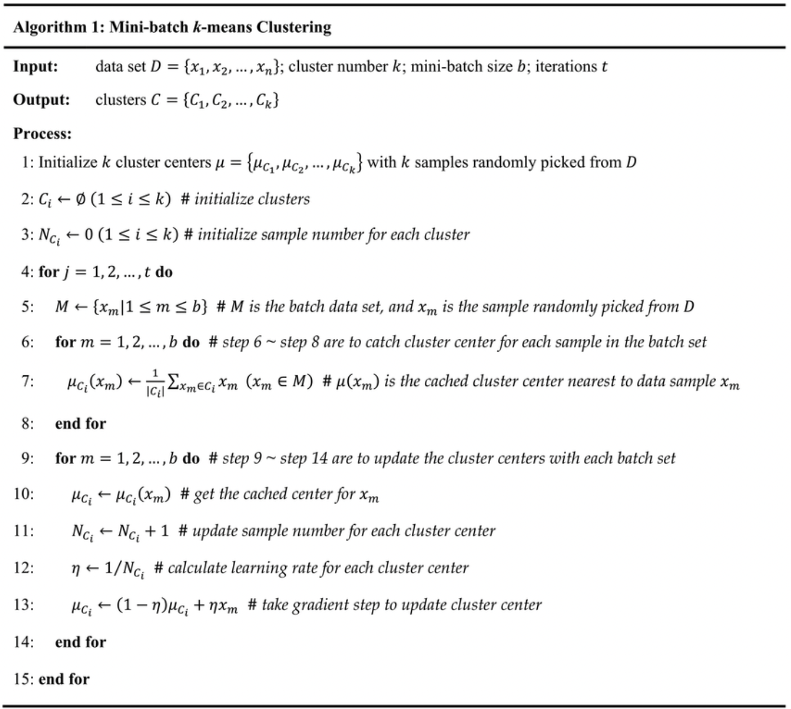
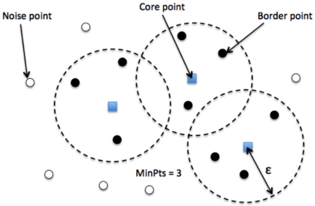

# Unsupervised Machine Learning Algorithms

## Introduction to Clustering
Clustering algorithms are used to group data points based on certain similarities. There’s no criterion for good clustering. Clustering determines the grouping with unlabelled data. It mainly depends on the specific user and the scenario. Clusters found by one clustering algorithm will definitely be different from clusters found by a different algorithm.

Typical cluster models include:

1.  Connectivity models – like Hierarchical clustering, which builds models based on distance connectivity.
1.  Centroid models – like K-Means clustering, which represents each cluster with a single mean vector.
1.  Distribution models – here, clusters are modeled using statistical distributions.
1.  Density models – like DBSCAN and OPTICS, which define clustering as a connected dense region in data space.
1.  Group models – These models don’t provide refined results. They only offer grouping information.
1.  Graph-based models – A subset of nodes in the graph such that an edge connects every two nodes in the subset can be considered as a prototypical form of cluster.
1.  Neural models – Self-organizing maps are one of the most commonly known Unsupervised Neural networks (NN), and they’re characterized as similar to one or more models above.

## Agglomerative hierarchical clustering (AHC)

### Introduction

1.  The Agglomerative Hierarchical Cluster algorithm is a form of bottom-up clustering, where it starts with an individual element and then groups them into single clusters. 

1.  Hierarchical clustering is often used in the form of descriptive modeling rather than predictive. It doesn’t work well on large datasets, it provides the best results in some cases only.
 
### Algorithm

1.  Each data point is treated as a single cluster. We have $K$ clusters in the beginning. At the start, the number of data points will also be $K$.

1.  Now we need to form a big cluster by joining $2$ closest data points in this step. This will lead to total $K-1$ clusters.

1.  Two closest clusters need to be joined now to form more clusters. This will result in $K-2$ clusters in total. 
1.  Repeat the above three steps until $K$ becomes $0$ to form one big cluster. No more data points are left to join.
1.  After forming one big cluster at last, we can use dendrograms to split the clusters into multiple clusters depending on the use case.

### Advantages

1. AHC is easy to implement, it can also provide object ordering, which can be informative for the display.
1.  We don’t have to pre-specify the number of clusters. It’s easy to decide the number of clusters by cutting the dendrogram at the specific level.
1.  In the AHC approach smaller clusters will be created, which may uncover similarities in data.

### Disadvantages

1.  The objects which are grouped wrongly in any steps in the beginning can’t be undone.
1.  Hierarchical clustering algorithms don’t provide unique partitioning of the dataset, but they give a hierarchy from which clusters can be chosen. 
1.  They don’t handle outliers well. Whenever outliers are found, they will end up as a new cluster, or sometimes result in merging with other clusters.

## K-Means Clustering Algorithm
[Source](https://sites.google.com/site/dataclusteringalgorithms/k-means-clustering-algorithm)

### Introduction

1.  Group similar data points together and discover underlying patterns.
1.  The K-means algorithm identifies $k$ number of centroids, and then allocates every data point to the nearest cluster, while keeping the centroids as small as possible.

### Cluster

1.  A cluster refers to a collection of data points aggregated together because of certain similarities.

### How it works

1.  To process the learning data, the K-means algorithm in data mining starts with a first group of randomly selected centroids, which are used as the beginning points for every cluster, and then performs iterative (repetitive) calculations to optimize the positions of the centroids.

1.  It halts creating and optimizing clusters when either:
    
    1.  The centroids have stabilized — there is no significant change in their values because the clustering has been successful.
    1.  The defined number of iterations has been achieved.
    
### Algorithm

Let  $X = {x1,x2,x3,……..,xn}$ be the set of data points and $V = {v1,v2,…….,vc}$ be the set of centers.

1.  Randomly select $C$ cluster centers.
1.  Calculate the distance between each data point and cluster centers.
1.  Assign the data point to the cluster center whose distance from the cluster center is minimum of all the cluster centers.
1.  Recalculate the new cluster center using: 
           $$\mu_i = \sum_{j=1}^{C_i} x_j$$
where, ‘$C_i$’ represents the number of data points in $i_{th}$ cluster.
1.  Recalculate the distance between each data point and new obtained cluster centers.
1.  If no data point was reassigned then stop, otherwise repeat from step 3). 

### Objective

1.  To minimize 
$$J = \sum_{i=1}^k \sum_{j=1}^{c_i} {||x_j - \mu_i ||}^2$$
1.  The number of optimal clusters are decided based on the above objective function (Elbow method) or any other metrics. 
1.  Elbow Method : When Loss vs $K$ graph is plotted, Usually it looks like an elbow where sudden huge decrease in the loss happens. That point is considered to be elbow and $K$ at the point is considered to be optimal. 
1.  As $K$ increases, loss always decreases. Therefore, we consider elbow point where there is a huge fall in the loss. 

1.  Difficult to find this point most of the times. If failed, then try to find the optimal point by measuring other metrics such as Silhouette score, DB Index etc, at each value of K.

### Limitations

1.  K-Means clustering is good at capturing the structure of the data if the clusters have a spherical-like shape. It always tries to construct a nice spherical shape around the centroid. This means that the minute the clusters have different geometric shapes, K-Means does a poor job clustering the data.

1.  This algorithm highly depends on the initialization. Therefore, in practice, we run the Kmeans algorithm several times with different initialization and consider that initialization with lower clustering loss. 

### Points to remember

1. Since K-Means use a distance-based measure to find the similarity between data points, it’s good to standardize the data to have a standard deviation of one and a mean of zero.
1. The elbow method used to select the number of clusters doesn’t work well as the error function decreases for all $K$'s.
1. If there’s overlap between clusters, K-Means doesn’t have an intrinsic measure for uncertainty for the examples belonging to the overlapping region to determine which cluster to assign each data point.
1. K-Means clusters data even if it can’t be clustered, such as data that comes from uniform distributions.

## Mini-Batch K-Means

1. An efficient version of K-Means. 
1. To reduce the complexity of K-Means, Mini batch K-Means is proposed. 
1. Pseudo code of the algorithm can be found below. It is similar to SGD. 

## Gaussian Mixture Model (GMM)

### Introduction

1.  GMM can be used to find clusters in the same way as K-Means. The probability that a point belongs to the distribution’s center decreases as the distance from the distribution center increases. The bands show a decrease in probability in the below image. 

1.  Since GMM contains a probabilistic model under the hood, we can also find the probabilistic cluster assignment. 
1.  *When you don’t know the type of distribution in data, you should use a different algorithm*.

### Parameters

A GMM is a function composed of several Gaussians, each identified by $K$, where $K$ is the number of clusters. Each Gaussian $K$ in the mixture is comprised of following parameters:

1.  A mean $\mu$ that defines its center.
1.  A covariance $\sum$ that defines its width.

### Algorithm
The mean and variance for each gaussian is determined using a technique called Expectation-Maximization (EM).

### Expectation-Maximization in Gaussian Mixture Models

1.  We typically use EM when the data has missing values, or in other words, when the data is incomplete.
1.  Expectation :  
For each point $x_i$, calculate the probability that it belongs to cluster/distribution $c1, c2, … ck$. This is done using the below formula:
    $$r_{ic} = \frac{P(x_i \in c_i)}{\sum_j P(x_i \in c_j) ....}$$
    This value will be high when the point is assigned to the correct cluster and lower otherwise.
1.  The mean and the covariance matrix are updated based on the values assigned to the distribution, in proportion with the probability values for the data point. Hence, a data point that has a higher probability of being a part of that distribution will contribute a larger portion:
$$\mu_c = \frac{1}{N_c}\sum_i r_{ic}x_i$$
$$\sum_c = \frac{1}{N_c} \sum_i r_{ic}(x_i - \mu_c)^T(x_i - \mu_c) $$

### Advantages

1.  One of the advantages of GMM over K-Means is that K-Means doesn’t account for variance (here, variance refers to the width of the bell-shaped curve) and GMM returns the probability that data points belong to each of K clusters. 
1.  In case of overlapped clusters, all the above clustering algorithms fail to identify it as one cluster. 
1.  GMM uses a probabilistic approach and provides probability for each data point that belongs to the clusters. 

### Disadvantages

1.  Mixture models are computationally expensive if the number of distributions is large or the dataset contains less observed data points.
1.  It needs large datasets and it’s hard to estimate the number of clusters.

## DBSCAN clustering

[Video to watch](https://www.youtube.com/watch?v=C3r7tGRe2eI&t=714s)

### Introduction

1.  This type of clustering technique connects data points that satisfy particular density criteria (minimum number of objects within a radius).
1.  The DBSCAN algorithm views clusters as areas of high density separated by areas of low density. Due to this rather generic view, clusters found by DBSCAN can be any shape, as opposed to k-means which assumes that clusters are convex shaped. 
1.  There are three types of points: core, border, and noise. See below figure.

Core is a point that has some $(m)$ points within a particular $(n)$ distance from itself. The border is a point that has at least one core point at distance $n$. Noise is a point that is neither border nor core.

### Parameters

1.  $minPts$: for a region to be considered dense, the minimum number of points required is $minPts$.
1.  $eps$: to locate data points in the neighborhood of any points, eps($\epsilon$) is used as a distance measure.

### Algorithm
Better to watch the above video than reading the text.
### Implementation

1.  The DBSCAN algorithm is deterministic, always generating the same clusters when given the same data in the same order. However, the results can differ when data is provided in a different order. 

1.  First, even though the core samples will always be assigned to the same clusters, the labels of those clusters will depend on the order in which those samples are encountered in the data. 

1.  Second and more importantly, the clusters to which non-core samples are assigned can differ depending on the data order. This would happen when a non-core sample has a distance lower than $eps$ to two core samples in different clusters. By the triangular inequality, those two core samples must be more distant than eps from each other, or they would be in the same cluster. The non-core sample is assigned to whichever cluster is generated first in a pass through the data, and so the results will depend on the data ordering.

### Limitations

It expects some kind of density drop to detect cluster borders. DBSCAN connects areas of high example density. The algorithm is better than K-Means when it comes to oddly shaped data.

### Advantages

1.  It doesn’t require a predefined number of clusters. 
1.  It also identifies noise and outliers. Furthermore, arbitrarily sized and shaped clusters are found pretty well by the algorithm.

## Metrics

### Silhouette score

1.  Silhouette analysis can be used to study the separation distance between the resulting clusters. The silhouette plot displays a measure of how close each point in one cluster is to points in the neighboring clusters and thus provides a way to assess parameters like number of clusters visually. This measure has a range of $[-1, 1]$.
1.  A value of $+1$ indicates sample is far way from the neighboring clusters. A value of $0$ indicates that the sample is on or very close to the decision boundary between two neighboring clusters and negative values indicate that those samples might have been assigned to the wrong cluster.
1.  The score is higher when clusters are dense and well separated, which relates to a standard concept of a cluster.
1.  Formula
    $$sihouette score(s) = \frac{b - a}{
    max(a,b)}$$
    where $a$: The mean distance between a sample and all other points in the same class. \
    $b$: The mean distance between a sample and all other points in the next nearest cluster.
1.  Limitations :
The Silhouette Coefficient is generally higher for convex clusters than other concepts of clusters, such as density based clusters like those obtained through DBSCAN.

### Davies Bouldin Index (DBI)

The index is defined as the average similarity between each cluster 
$C_i$ for $i = 1,2,.. ,k$ and its most similar one $C_j$. In the context of this index, similarity is defined as a measure $R_{ij}$ that trades off:

1.  $s_i$, the average distance between each point of cluster $i$ and the centroid of that cluster – also know as cluster diameter.
1.  $d_{ij}$, the distance between cluster centroids i and j.

A simple choice to construct $R_{ij}$ so that it is nonnegative and symmetric is:
$$R_{ij} = \frac{s_i + s_j}{d_{ij}}$$

Then the Davies-Bouldin index is defined as:
$$DB = \sum_{i = 1}^k max_{i\neq j} R_i$$
 

# Anomaly detection Techniques

## Isolation Forest (BASIC INTRO)

1.  Isolation forest is a machine learning algorithm for anomaly detection.
1.  It's an unsupervised learning algorithm that identifies anomaly by isolating outliers in the data.
1.  Isolation Forest is based on the Decision Tree algorithm. It isolates the outliers by randomly selecting a feature from the given set of features and then randomly selecting a split value between the max and min values of that feature. This random partitioning of features will produce shorter paths in trees for the anomalous data points, thus distinguishing them from the rest of the data.
1.  Isolation Forest isolates anomalies in the data points instead of profiling normal data points. As anomalies data points mostly have a lot shorter tree paths than the normal data points, trees in the isolation forest does not need to have a large depth so a smaller $max\_depth$ can be used resulting in low memory requirement.
1.  Using Isolation Forest, we can detect anomalies faster and also require less memory compared to other algorithms.
1.  We can use sklearn.ensemble.IsolationForest 