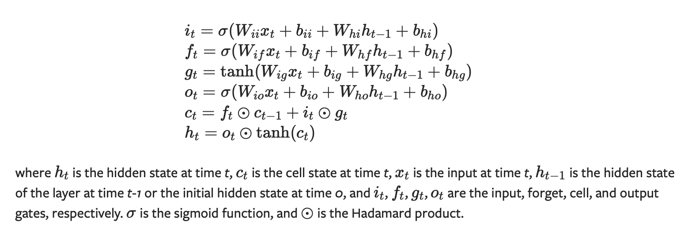
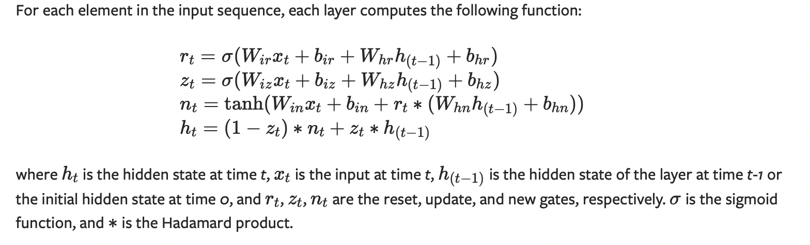
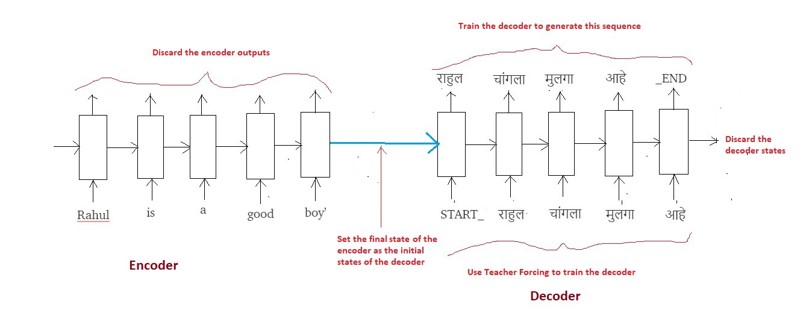
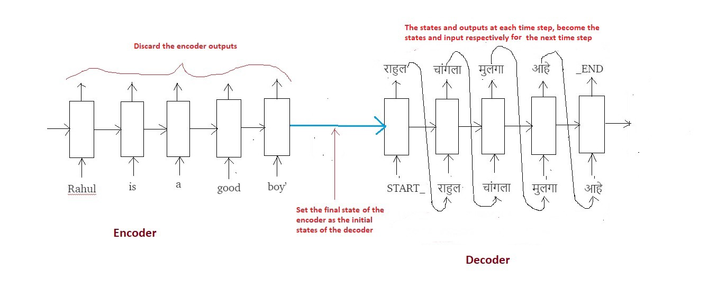
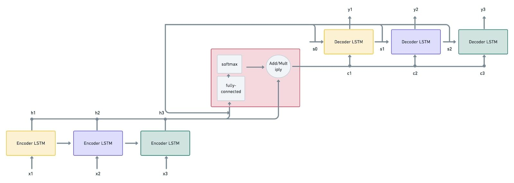
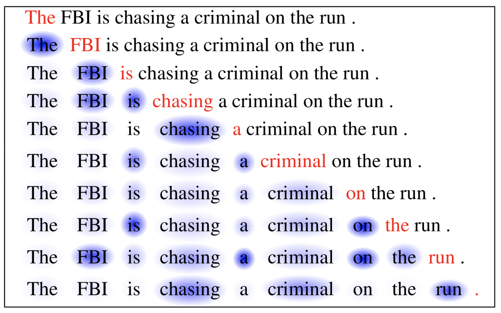

# Sequence Models

[Stanford Cheat Sheet](https://stanford.edu/~shervine/teaching/cs-230/cheatsheet-recurrent-neural-networks#overview)

# Recurrent Neural Networks (RNN)
[Andrej Karpathy Blog](http://karpathy.github.io/2015/05/21/rnn-effectiveness/)

## Why RNN ?

A glaring limitation of Vanilla Neural Networks (and also Convolutional Networks) is that their API is too constrained: they accept a fixed-sized vector as input (e.g. an image) and produce a fixed-sized vector as output (e.g. probabilities of different classes). Not only that: These models perform this mapping using a fixed amount of computational steps (e.g. the number of layers in the model). The core reason that recurrent nets are more exciting is that they allow us to operate over sequences of vectors: Sequences in the input, the output, or in the most general case both. 

### Introduction

1. All recurrent neural networks have the form of a chain of repeating modules of neural network. In standard RNNs, this repeating module will have a very simple structure, such as a single tanh layer.
1. Even if the data is not in form of sequences, we can still formulate and train powerful models that learn to process it sequentially. 
1. RNNs have a deceptively simple API: They accept an input vector $x$ and give you an output vector $y$. However, crucially this output vector’s contents are influenced not only by the input you just fed in, but also on the entire history of inputs you’ve fed in in the past.

### Limitation

1. Sometimes, we only need to look at recent information to perform the present task. For example, consider a language model trying to predict the next word based on the previous ones. If we are trying to predict the last word in “the clouds are in the sky,” we don’t need any further context – it’s pretty obvious the next word is going to be sky. In such cases, where the gap between the relevant information and the place that it’s needed is small, RNNs can learn to use the past information. But there are also cases where we need more context. Consider trying to predict the last word in the text “I grew up in France… I speak fluent French.” Recent information suggests that the next word is probably the name of a language, but if we want to narrow down which language, we need the context of France, from further back. It’s entirely possible for the gap between the relevant information and the point where it is needed to become very large. Unfortunately, as that gap grows, RNNs become unable to learn to connect the information.
1. RNNs also suffer from vanishing gradients problem.

## Long Short Term Memory networks (LSTMs)

[Best source to understand LSTM](https://colah.github.io/posts/2015-08-Understanding-LSTMs/)

### Introduction

#### Why

1. LSTMs are explicitly designed to avoid the long-term dependency problem. Remembering information for long periods of time is practically their default behavior, not something they struggle to learn!

1. LSTM also solve the problem of vanishing gradients. [Watch this video for clear understanding](https://www.youtube.com/watch?v=dKKPtG-qeaI&list=PLEAYkSg4uSQ1r-2XrJ_GBzzS6I-f8yfRU&index=112). 

### Mathematical Equations

## Gated Recurrent Units 

# Encoder Decoder Models

[Medium Blog](https://towardsdatascience.com/word-level-english-to-marathi-neural-machine-translation-using-seq2seq-encoder-decoder-lstm-model-1a913f2dc4a7)

### Introduction 

Encoder Decoder Basic Architecture (Without involving attention)

The most common architecture used to build Seq2Seq models is the Encoder Decoder architecture.

1. Both encoder and the decoder are typically LSTM models (or sometimes GRU models)

1. Encoder reads the input sequence and summarizes the information in something called as the internal state vectors (in case of LSTM these are called as the hidden state and cell state vectors). We discard the outputs of the encoder and only preserve the internal states.

1. Decoder is an LSTM whose initial states are initialized to the final states of the Encoder LSTM. Using these initial states, decoder starts generating the output sequence.

1. The decoder behaves a bit differently during the training and inference procedure. During the training, we use a technique call teacher forcing which helps to train the decoder faster. “Teacher forcing” is the concept of using the real target outputs as each next input, instead of using the decoder’s guess as the next input. Using teacher forcing causes it to converge faster but when the trained network is exploited, it may exhibit instability.

1. During inference, the input to the decoder at each time step is the output from the previous time step.

1. Intuitively, the encoder summarizes the input sequence into state vectors (sometimes also called as Thought vectors), which are then fed to the decoder which starts generating the output sequence given the Thought vectors. The decoder is just a language model conditioned on the initial states.

### Encoder
Explaining with the example of neural machine translation (English to Marathi translation) 
#### Summary of the encoder
We will read the input sequence (English sentence) word by word and preserve the internal states of the LSTM network generated after the last time step $h_t$, $c_t$ (assuming the sentence has $t$ words). These vectors (states $h_t$ and $c_t$) are called as the encoding of the input sequence, as they encode (summarize) the entire input in a vector form. Since we will start generating the output once we have read the entire sequence, outputs ($Y_i$) of the Encoder at each time step are discarded.

### Decoder

1. If the input “Rahul is a good boy”, the goal of the training process is to train (teach) the decoder to output “राहुल चांगला मुलगा आहे”. Just as the Encoder scanned the input sequence word by word, similarly the Decoder will generate the output sequence word by word. To identify the sentence beginning and ending, we add two more tokens <$START\_$> and <$\_END$>. 
1. The most important point is that the initial states $(h_0, c_0)$ of the decoder are set to the final states of the encoder. This intuitively means that the decoder is trained to start generating the output sequence depending on the information encoded by the encoder. Obviously the translated Marathi sentence must depend on the given English sentence.

1. In the first time step we provide the <$START\_$> token so that the decoder starts generating the next token (the actual first word of Marathi sentence). And after the last word in the Marathi sentence, we make the decoder learn to predict the <$\_END$> token. This will be used as the stopping condition during the inference procedure, basically it will denote the end of the translated sentence and we will stop the inference loop (more on this later).

1. We use a technique called “Teacher Forcing” wherein the input at each time step is given as the actual output (and not the predicted output) from the previous time step. This helps in more faster and efficient training of the network. 
1. Finally the loss is calculated on the predicted outputs from each time step and the errors are back propagated through time in order to update the parameters of the network. Training the network over longer period with sufficiently large amount of data results in pretty good predictions (translations).

### Inference Algorithm 

1. During inference, we generate one word at a time. Thus the Decoder LSTM is called in a loop, every time processing only one time step.
1. The initial states of the decoder are set to the final states of the encoder.
1. The initial input to the decoder is always the $START\_$ token.
1. At each time step, we preserve the states of the decoder and set them as initial states for the next time step.
1. At each time step, the predicted output is fed as input in the next time step.
1. We break the loop when the decoder predicts the $\_END$ token.

### Limitations

1. The context vector is of a fixed length. Assume that there’s a long sequence that has to be encoded. Owing to the encoded vector’s constant size, it can get difficult for the network to define an encoded representation for long sequences. Oftentimes, it may forget the earlier parts of the sequence, leading to the loss of vital information.

1.  A sequence-to-sequence model considers the encoder’s final state as the context vector to be passed on to the decoder. In other words, it doesn’t examine the intermediate states generated during the encoding process. This can also contribute to the loss of information if there are long sequences of input data involved.

# Attention Mechanism

1. [FloydHub-Blog](https://blog.floydhub.com/attention-mechanism/)
1. [Paper-Space-Blog](https://blog.paperspace.com/seq-to-seq-attention-mechanism-keras/)

### Why

Going by the typical English vocabulary, “Attention” refers to directing your focus on something. The attention mechanism aims to solve both of the issues with encoder-decoder models when training a neural machine translation model with a sequence-to-sequence model. Firstly, when there’s attention integrated, the model need not compress the encoded output into a single context vector. Instead, it encodes the input sequence into a sequence of vectors and picks a subset of these vectors depending on the decoder’s hidden states. In a nutshell, there’s “attention” applied to choose what’s necessary, without letting go of other necessary information.

### Introduction

In broad terms, Attention is one component of a network’s architecture, and is in charge of managing and quantifying the interdependence:

1. Between the input and output elements (General Attention)
1. Within the input elements (Self-Attention)

#### An example of how Attention works in a translation task

Say we have the sentence “How was your day”, which we would like to translate to the French version - “Comment se passe ta journée”. What the Attention component of the network will do for each word in the output sentence is map the important and relevant words from the input sentence and assign higher weights to these words, enhancing the accuracy of the output prediction.

The catch in an attention mechanism model is that the context vectors enable the decoder to focus only on certain parts of its input (in fact, context vectors are generated from the encoder’s outputs). This way, the model stays attentive to all those inputs which it thinks are crucial in determining the output.

### Step by Step procedure

1. Firstly, the input sequence $x_1,x_2,x_3$ is given to the encoder LSTM. The vectors $h_1,h_2,h_3$ are computed by the encoders from the given input sequence. These vectors are the inputs given to the attention mechanism. This is followed by the decoder inputting the first state vector $s_0$, which is also given as an input to the attention mechanism. We now have $s_0$ and $h_1,h_2,h_3$
as inputs.

1. The attention mechanism mode (depicted in a red box) accepts the inputs and passes them through a fully-connected network and a softmax activation function, which generates the “attention weights”.

The weighted sum of the encoder’s output vectors is then computed, resulting in a context vector $c_1$. Here, the vectors are scaled according to the attention weights.

1. It’s now the decoder's job to process the state and context vectors to generate the output vector $y_1$.

The decoder also produces the consequent state vector $s_1$, which is again given to the attention mechanism model along with the encoder’s outputs.

1. This produces the weighted sum, resulting in the context vector $c_2$. This process continues until all the decoders have generated the output vectors $y_1,y_2,y_3$.

### Types of attention

#### Self-Attention

Self-Attention helps the model to interact within itself. The attention here is computed within the same sequence. In other words, self-attention enables the input elements to interact among themselves.

#### Soft attention

1. Soft attention ‘softly’ places the attention weights over all patches of the input (image/sentence), i.e., it employs the weighted average mechanism. 

1. It measures the attention concerning various chunks of the input, and outputs the weighted input features. It discredits the areas which are irrelevant to the task at hand by assigning them low weights. This way, soft attention doesn’t confine its focus to specific parts of the image or the sentence; instead, it learns continuously. (This is somewhat similar to soft clustering like gmm where we assign some low probability to irrelevant clusters rather than assigning directly 0). 

1. Soft attention is a fully differentiable attention mechanism, where the gradients can be propagated automatically during backpropagation.

#### Hard Attention

“Hard”, as the name suggests, focuses on only a specific part of the image/sentence (I think, irrelevant parts are assigned 0). During backpropagation, to estimate the gradients for all the other states, we need to perform sampling and average the results using the Monte Carlo method.