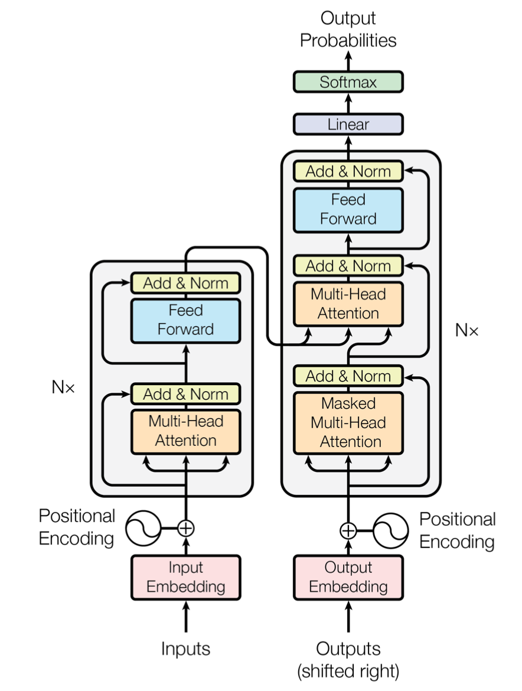
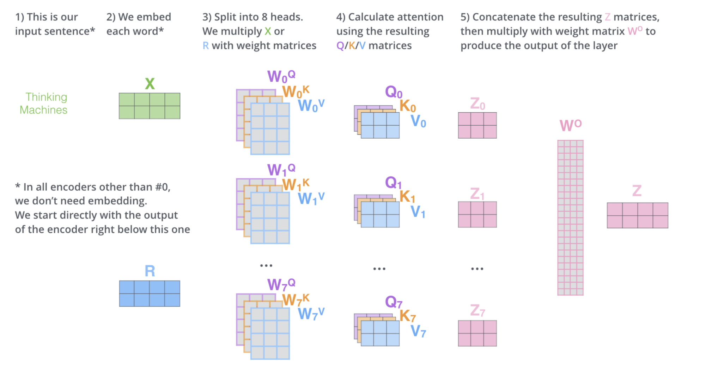

# Transformers 
1. [Main Source](http://jalammar.github.io/illustrated-transformer/) 
1. [Other source](http://peterbloem.nl/blog/transformers)  
1. [Implementation with explanation](http://nlp.seas.harvard.edu/2018/04/03/attention.html) 
1. [Paper](https://arxiv.org/abs/1706.03762)

## Introduction
1. The Transformer – a model that uses attention to boost the speed with which these neural machine translation models can be trained.
1. Transformer model contains a 
    1. Positional encoding component
    1. Encoder (Self-Atttention and Feed Forward)
    1. Decoder (Self-Attention, Encoder-Decoder Attention, Feed Forward)
1. A simple tansformer with 2 encoders and 2 decoder can bee seen in image 

## Encoder and Decoder
### Encoder
1. The encoder is composed of a stack of N = 6 identical layers. Each layer has two sub-layers. 
The first is a multi-head self-attention mechanism, and the second is a simple, position-wise fully connected feed-forward network. 

1. We employ a residual connection [11] around each of the two sub-layers, followed by layer normalization [1]. That is, the output of each sub-layer is LayerNorm(x + Sublayer(x)), where Sublayer(x) is the function implemented by the sub-layer itself. 

1. To facilitate these residual connections, all sub-layers in the model, as well as the embedding layers, produce outputs of dimension dmodel = 512.

### Decoder
1. The decoder is also composed of a stack of N = 6 identical layers. In addition to the two sub-layers in each encoder layer, the decoder inserts a third sub-layer, which performs multi-head attention over the output of the encoder stack. 

1. Similar to the encoder, we employ residual connections around each of the sub-layers, followed by layer normalization. We also modify the self-attention sub-layer in the decoder stack to prevent positions from attending to subsequent positions. **This masking, combined with fact that the output embeddings are offset by one position, ensures that the predictions for position i can depend only on the known outputs at positions less than i.**

## Self-Attention

### Introduction
1. Self-attention is a sequence-to-sequence operation: a sequence of vectors goes in, and a sequence of vectors comes out. Let’s call the input vectors $x_1$, $x_2$…...., $x_t$ and the corresponding output vectors $y_1$, $y_2$…...., $y_t$ The vectors all have dimension k.

1. We need to score each word of the input sentence against this word. The score determines how much focus to place on other parts of the input sentence as we encode a word at a certain position.

1. To produce output vector $y_i$, the self attention operation simply takes a weighted average over all the input vectors.
$$y_i = \sum_j w_{ij} x_j$$

1. Where j indexes over the whole sequence and the weights sum to one over all j. The weight $w_{ij}$ is not a parameter, as in a normal neural net, but it is derived from a function over $x_i$ and $x_j$ the simplest option for this function is the dot product:
    $$w′_{ij} = {x_i}^T x_j$$

1.  Note that $x_i$ is the input vector at the same position as the current output vector $y_i$. For the next output vector, we get an entirely new series of dot products, and a different weighted sum.
1.  The dot product gives us a value anywhere between negative and positive infinity, so we apply a softmax to map the values to [0,1] and to ensure that they sum to 1 over the whole sequence:

$$ w_{ij}=\frac{exp w′_{ij}}{\sum_j exp w′_{ij}}$$

Look at figure

### Understanding why self-attention works

1.  To build up some intuition, let’s look first at the standard approach to movie recommendation.

1.  Let’s say you run a movie rental business and you have some movies, and some users, and you would like to recommend movies to your users that they are likely to enjoy.

1.  One way to go about this, is to create manual features for your movies, such as how much romance there is in the movie, and how much action, and then to design corresponding features for your users: how much they enjoy romantic movies and how much they enjoy action-based movies. If you did this, the dot product between the two feature vectors would give you a score for how well the attributes of the movie match what the user enjoys.

1.  If the signs of a feature match for the user and the movie then the resulting dot product gets a positive term for that feature. If the signs don’t match the corresponding term is negative.

1.  Furthermore, the magnitudes of the features indicate how much the feature should contribute to the total score.

#### Example

1.  To apply self-attention, we simply assign each word t in our vocabulary an embedding vector $x_t$ (the values of which we’ll learn). This is what’s known as an embedding layer in sequence modeling. It turns the word sequence the,cat,walks,on,the,street into the vector sequence $v_{the}$,$v_{cat}$, $v_{walks}$, $v_{on}$, $v_{the}$, $v_{street}$. Embedding the vector is again a different concept. Details are not required for now.

1.  If we feed this sequence into a self-attention layer, the output is another sequence of vectors
$y_{the}$,$y_{cat}$, $y_{walks}$, $y_{on}$, $y_{the}$, $y_{street}$
where $y_{cat}$ is a weighted sum over all the embedding vectors in the first sequence, weighted by their (normalized) dot-product with $v_{cat}$.

1.  Since we are learning what the values in $x_t$ should be, how "related" two words are is entirely determined by the task. In most cases, the definite article "the" is not very relevant to the interpretation of the other words in the sentence; therefore, we will likely end up with an embedding $v_{the}$ that has a low or negative dot product with all other words. 

1.  On the other hand, to interpret what walks means in this sentence, it's very helpful to work out who is doing the walking. This is likely expressed by a noun, so for nouns like cat and verbs like walks, we will likely learn embeddings $v_{cat}$ and $v_{walks}$ that have a high, positive dot product together.

1.  This is the basic intuition behind self-attention. The dot product expresses how related two vectors in the input sequence are, with “related” defined by the learning task, and the output vectors are weighted sums over the whole input sequence, with the weights determined by these dot products.

#### Queries, Keys and Values

1.  The first step in calculating self-attention is to create three vectors from each of the encoder’s input vectors (in this case, the embedding of each word). So for each word, we create a Query vector, a Key vector, and a Value vector. These vectors are created by multiplying the embedding by three matrices that we trained during the training process.

1.  Notice that these new vectors are smaller in dimension than the embedding vector. Their dimensionality is 64, while the embedding and encoder input/output vectors have dimensionality of 512. They don’t HAVE to be smaller, this is an architecture choice to make the computation of multiheaded attention (mostly) constant.

### Computing Self Attention

#### First Step
To compute Query, Key and Value vectors. 
#### Second step to compute score

1.  The second step in calculating self-attention is to calculate a score. Say we’re calculating the self-attention for the first word in this example, “Thinking”. We need to score each word of the input sentence against this word. The score determines how much focus to place on other parts of the input sentence as we encode a word at a certain position.

 1.  The score is calculated by taking the \textbf{dot product of the query vector with the key vector} of the respective word we’re scoring. So if we’re processing the self-attention for the word in position #1, the first score would be the dot product of q1 and k1. The second score would be the dot product of q1 and k2.

#### Scaling the dot product

1.  The softmax function can be sensitive to very large input values. These kill the gradient, and slow down learning, or cause it to stop altogether. Since the average value of the dot product grows with the embedding dimension k, it helps to scale the dot product back a little to stop the inputs to the softmax function from growing too large:

$$ w′_{ij} = \frac{{q_i}^T k_j}{\sqrt{k}}$$

1.  Why $\sqrt{k}$, Imagine a vector in $\Re^k$ with values all c. Its Euclidean length is $\sqrt{k}c$. Therefore, we are dividing out the amount by which the increase in dimension increases the length of the average vectors.

#### Fourth Step

1.  Then pass the result through a softmax operation. Softmax normalizes the scores so they’re all positive and add up to 1.

1.  This softmax score determines how much each word will be expressed at this position. Clearly the word at this position will have the highest softmax score, but sometimes it’s useful to attend to another word that is relevant to the current word.

#### Fifth step
The Fifth step is to multiply each value vector by the softmax score (in preparation to sum them up). The intuition here is to keep intact the values of the word(s) we want to focus on, and drown-out irrelevant words (by multiplying them by tiny numbers like 0.001, for example).

#### Sixth Step

1.  The sixth step is to sum up the weighted value vectors. This produces the output of the self-attention layer at this position (for the first word).

1.  That concludes the self-attention calculation. The resulting vector is one we can send along to the feed-forward neural network.

### Multi-head Self Attention

This improves the performance of the attention layer in two ways:

1. It expands the model’s ability to focus on different positions. It gives the attention layer multiple “representation subspaces”. 

1. With multi-headed attention we have not only one, but multiple sets of Query/Key/Value weight matrices(the Transformer uses eight attention heads, so we end up with eight sets for each encoder/decoder). 

1. Each of these sets is randomly initialized. Then, after training, each set is used to project the input embeddings (or vectors from lower encoders/decoders) into a different representation subspace.

1. Look at the bewlow figure : 

## Positional Encoding

1. This is a way to account for the order of the words in the input sequence. To this end, we add "positional encodings" to the input embeddings at the bottoms of the encoder and decoder stacks. 

1. The positional encodings have the same dimension dmodel as the embeddings, so that the two can be summed.

1. There are many choices of positional encodings, learned and fixed. However, In this work, they used sine and cosine functions of different frequencies: $$PE(pos,2i) = sin(pos/10000^{2i}/dmodel)$$ $$PE(pos,2i+1) = cos(pos/10000^{2i}/dmodel)$$ where $pos$ is the position and $i$ is the dimension. 

1. That is, each dimension of the positional encoding corresponds to a sinusoid. The wavelengths form a geometric progression from 2π to 10000·2π. 

1. They chose this function because they hypothesized it would allow the model to easily learn to attend by relative positions, since for any fixed offset $k$, $P E_{pos+k}$ can be represented as a linear function of $PE_{pos}$.

1. Sinusoidal version has been chosen because it may allow the model to extrapolate to sequence lengths longer than the ones encountered during training.

